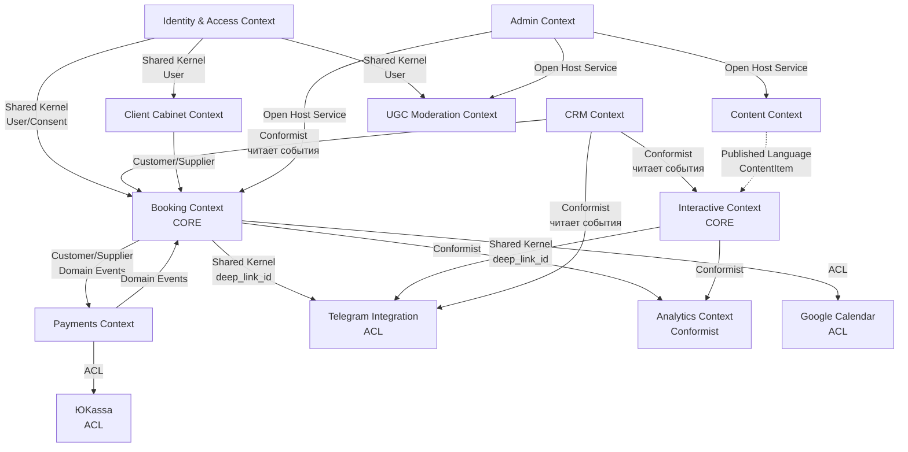

# Спецификация доменной модели — «Эмоциональный баланс»

**Версия:** v1.0  
**Дата:** 2026-01-07  
**Основано на:** `docs/Модель-данных.md`, `docs/Архитектурный-обзор.md`, принципы DDD и Clean Architecture

---

## 1) Назначение документа

Этот документ описывает **доменную модель** проекта в терминах **Domain-Driven Design (DDD)**:
- Aggregate Roots и границы агрегатов
- Entities и Value Objects
- Domain Services
- Domain Events
- Repository Interfaces
- Context Mapping между доменами

**Важно:** Этот документ описывает **логическую доменную модель**, а не физическую схему БД. 
Физическая схема (таблицы, индексы) находится в `docs/Модель-данных.md`.

**Связь с Clean Architecture:**
```
Domain Layer (этот документ)
  ↑
Application Layer (Use Cases)
  ↑
Infrastructure Layer (Repositories, Integrations)
  ↑
Presentation Layer (Controllers, UI)
```

---

## 2) Принципы доменной модели

### 2.1 Aggregate Rules

✅ **Aggregate Root** — единственная точка входа для изменений  
✅ **Границы транзакций** = границы агрегата  
✅ **Ссылки между агрегатами** — только по ID  
✅ **Consistency boundary** — внутри агрегата строгая, между агрегатами — eventual  
✅ **Маленькие агрегаты** — 1 root + 1-3 внутренних entity/VO  

### 2.2 Entity vs Value Object

| Entity | Value Object |
|--------|--------------|
| Имеет уникальный ID | Определяется атрибутами |
| Изменяемое (mutable) | Неизменяемое (immutable) |
| Имеет жизненный цикл | Без жизненного цикла |
| Сравнивается по ID | Сравнивается по значениям |
| Пример: `Appointment`, `User` | Пример: `Money`, `TimeSlot`, `Email` |

### 2.3 Domain Events

✅ События в прошедшем времени: `AppointmentConfirmed`, `PaymentSucceeded`  
✅ Неизменяемые (immutable)  
✅ Содержат минимум данных (ID + ключевые атрибуты)  
✅ Не содержат PII/чувствительные данные без необходимости  

---

## 3) Bounded Contexts и Context Map

### 3.1 Список Bounded Contexts

```
Core Domain (основной):
  1. Booking (запись на консультацию)
  2. Interactive (интерактивы)

Supporting Domains (поддерживающие):
  3. Content (контент)
  4. Identity & Access (пользователи)
  5. Payments (оплата)
  6. Client Cabinet (личный кабинет)
  7. CRM & Leads (лиды)

Generic Domains (общие):
  8. UGC Moderation (модерация)
  9. Admin & Audit (админка)
  10. Telegram Integration (интеграция)
  11. Analytics (аналитика)
```

### 3.2 Context Map (связи между контекстами)



**Типы связей:**
- **Customer/Supplier** — клиент подписывается на события поставщика
- **Shared Kernel** — общие концепции (минимизировать!)
- **ACL (Anti-Corruption Layer)** — защитный слой от внешних систем
- **Conformist** — подстраивается под другой контекст (аналитика)
- **Published Language** — публичный API контекста

---

## 4) Booking Context (Bounded Context #1 — CORE)

### 4.1 Ubiquitous Language

| Термин | Определение |
|--------|-------------|
| **Appointment** | Подтвержденная встреча клиента с психологом |
| **Service** | Услуга (индивидуальная/парная консультация, формат, длительность) |
| **TimeSlot** | Временной интервал (начало, конец, таймзона) |
| **Availability** | Доступность психолога для записи |
| **Booking** | Процесс записи (от выбора до подтверждения) |
| **Conflict** | Пересечение слотов/встреч |
| **Cancellation** | Отмена встречи (с правилами возврата) |
| **No-show** | Неявка клиента |
| **Waitlist** | Лист ожидания при отсутствии слотов |

### 4.2 Aggregate: Appointment (Root)

#### Aggregate Boundary

```
┌─────────────────────────────────────────┐
│ Appointment (Aggregate Root)            │
│  - AppointmentId (identity)             │
│  - ServiceId (reference)                │
│  - ClientId (reference)                 │
│  - TimeSlot (Value Object)              │
│  - AppointmentStatus (Value Object)     │
│  - Format (Value Object)                │
│  - BookingMetadata (Value Object)       │
│                                         │
│  ┌────────────────────────────────┐   │
│  │ Payment (Entity)               │   │
│  │  - PaymentId                   │   │
│  │  - Money (VO)                  │   │
│  │  - PaymentStatus (VO)          │   │
│  │  - ProviderId                  │   │
│  └────────────────────────────────┘   │
│                                         │
│  ┌────────────────────────────────┐   │
│  │ IntakeForm (Entity) - optional │   │
│  │  - FormId                      │   │
│  │  - EncryptedPayload            │   │
│  │  - SubmittedAt                 │   │
│  └────────────────────────────────┘   │
│                                         │
│  ┌────────────────────────────────┐   │
│  │ OutcomeRecord (Entity)         │   │
│  │  - Outcome (attended/no-show)  │   │
│  │  - RecordedAt                  │   │
│  └────────────────────────────────┘   │
└─────────────────────────────────────────┘
```

#### Domain Model (TypeScript-like)

```typescript
// Aggregate Root
export class Appointment {
  private constructor(
    private readonly id: AppointmentId,
    private serviceId: ServiceId,
    private clientId: ClientId,
    private slot: TimeSlot,
    private status: AppointmentStatus,
    private format: AppointmentFormat,
    private metadata: BookingMetadata,
    private payment?: Payment,
    private intakeForm?: IntakeForm,
    private outcomeRecord?: OutcomeRecord,
    private domainEvents: DomainEvent[] = []
  ) {}

  // Factory Methods
  static create(
    service: Service,
    clientId: ClientId,
    slot: TimeSlot,
    format: AppointmentFormat,
    metadata: BookingMetadata
  ): Appointment {
    // Бизнес-правила
    if (slot.isInPast()) {
      throw new DomainError('Cannot book appointment in the past');
    }
    
    if (!service.isAvailableFor(format)) {
      throw new DomainError(`Service does not support ${format} format`);
    }

    const appointment = new Appointment(
      AppointmentId.generate(),
      service.id,
      clientId,
      slot,
      AppointmentStatus.PendingPayment,
      format,
      metadata
    );

    appointment.addDomainEvent(
      new AppointmentCreatedEvent(
        appointment.id,
        appointment.serviceId,
        appointment.slot,
        appointment.metadata.deepLinkId
      )
    );

    return appointment;
  }

  // Business Methods
  confirmPayment(payment: Payment, service: Service): void {
    // Бизнес-правила
    if (!this.status.isPendingPayment()) {
      throw new DomainError('Appointment is not waiting for payment');
    }

    if (!payment.isSucceeded()) {
      throw new DomainError('Payment must be succeeded');
    }

    if (!payment.amount.equals(service.price)) {
      throw new DomainError('Payment amount does not match service price');
    }

    this.payment = payment;
    this.status = AppointmentStatus.Confirmed;

    this.addDomainEvent(
      new AppointmentConfirmedEvent(
        this.id,
        this.clientId,
        this.slot,
        this.serviceId.toSlug(),
        this.payment.amount
      )
    );
  }

  cancel(reason: CancellationReason, service: Service): Money | null {
    // Бизнес-правила
    if (!this.canBeCanceled()) {
      throw new DomainError('Appointment cannot be canceled');
    }

    const refundAmount = this.calculateRefund(service);
    this.status = AppointmentStatus.Canceled;

    this.addDomainEvent(
      new AppointmentCanceledEvent(
        this.id,
        reason,
        refundAmount
      )
    );

    return refundAmount;
  }

  reschedule(newSlot: TimeSlot, service: Service): void {
    if (!this.canBeRescheduled(service)) {
      throw new DomainError('Appointment cannot be rescheduled');
    }

    if (newSlot.isInPast()) {
      throw new DomainError('Cannot reschedule to past time');
    }

    const oldSlot = this.slot;
    this.slot = newSlot;
    this.status = AppointmentStatus.Rescheduled;

    this.addDomainEvent(
      new AppointmentRescheduledEvent(
        this.id,
        oldSlot,
        newSlot
      )
    );
  }

  recordOutcome(outcome: AppointmentOutcome): void {
    if (!this.status.isConfirmed() && !this.status.isCompleted()) {
      throw new DomainError('Cannot record outcome for non-confirmed appointment');
    }

    if (this.slot.isInFuture()) {
      throw new DomainError('Cannot record outcome for future appointment');
    }

    this.outcomeRecord = OutcomeRecord.create(outcome);
    this.status = AppointmentStatus.Completed;

    if (outcome.isNoShow()) {
      this.addDomainEvent(
        new AppointmentNoShowEvent(this.id, this.clientId)
      );
    }
  }

  attachIntakeForm(form: IntakeForm): void {
    if (!this.status.isPendingPayment() && !this.status.isConfirmed()) {
      throw new DomainError('Cannot attach form to invalid appointment');
    }

    this.intakeForm = form;
  }

  // Business Rules (приватные методы)
  private canBeCanceled(): boolean {
    return this.status.isConfirmed() || this.status.isPendingPayment();
  }

  private canBeRescheduled(service: Service): boolean {
    if (!this.status.isConfirmed()) {
      return false;
    }

    const hoursUntilAppointment = this.slot.hoursUntilStart();
    return hoursUntilAppointment >= service.rescheduleMinHours;
  }

  private calculateRefund(service: Service): Money | null {
    if (!this.payment) {
      return null;
    }

    const hoursUntilAppointment = this.slot.hoursUntilStart();

    if (hoursUntilAppointment >= service.cancelFreeHours) {
      // Полный возврат
      return this.payment.amount;
    } else if (hoursUntilAppointment >= service.cancelPartialHours) {
      // Частичный возврат (50%)
      return this.payment.amount.multiply(0.5);
    } else {
      // Без возврата
      return null;
    }
  }

  // Getters
  get appointmentId(): AppointmentId { return this.id; }
  get timeSlot(): TimeSlot { return this.slot; }
  get currentStatus(): AppointmentStatus { return this.status; }
  
  // Domain Events
  getDomainEvents(): DomainEvent[] {
    return [...this.domainEvents];
  }

  clearDomainEvents(): void {
    this.domainEvents = [];
  }

  private addDomainEvent(event: DomainEvent): void {
    this.domainEvents.push(event);
  }
}
```

#### Value Objects

```typescript
// TimeSlot Value Object
export class TimeSlot {
  constructor(
    readonly startAt: Date,
    readonly endAt: Date,
    readonly timezone: Timezone
  ) {
    if (endAt <= startAt) {
      throw new DomainError('End time must be after start time');
    }
  }

  isInPast(): boolean {
    return this.startAt < new Date();
  }

  isInFuture(): boolean {
    return this.startAt > new Date();
  }

  hoursUntilStart(): number {
    const now = new Date();
    return (this.startAt.getTime() - now.getTime()) / (1000 * 60 * 60);
  }

  overlaps(other: TimeSlot): boolean {
    return this.startAt < other.endAt && this.endAt > other.startAt;
  }

  durationMinutes(): number {
    return (this.endAt.getTime() - this.startAt.getTime()) / (1000 * 60);
  }

  equals(other: TimeSlot): boolean {
    return (
      this.startAt.getTime() === other.startAt.getTime() &&
      this.endAt.getTime() === other.endAt.getTime() &&
      this.timezone.equals(other.timezone)
    );
  }
}

// Money Value Object
export class Money {
  constructor(
    readonly amount: number,
    readonly currency: Currency
  ) {
    if (amount < 0) {
      throw new DomainError('Amount cannot be negative');
    }
  }

  add(other: Money): Money {
    this.ensureSameCurrency(other);
    return new Money(this.amount + other.amount, this.currency);
  }

  subtract(other: Money): Money {
    this.ensureSameCurrency(other);
    return new Money(this.amount - other.amount, this.currency);
  }

  multiply(factor: number): Money {
    return new Money(this.amount * factor, this.currency);
  }

  equals(other: Money): boolean {
    return this.amount === other.amount && this.currency.equals(other.currency);
  }

  private ensureSameCurrency(other: Money): void {
    if (!this.currency.equals(other.currency)) {
      throw new DomainError('Cannot operate on different currencies');
    }
  }
}

// AppointmentStatus Value Object
export class AppointmentStatus {
  private constructor(readonly value: string) {}

  static readonly PendingPayment = new AppointmentStatus('pending_payment');
  static readonly Confirmed = new AppointmentStatus('confirmed');
  static readonly Canceled = new AppointmentStatus('canceled');
  static readonly Rescheduled = new AppointmentStatus('rescheduled');
  static readonly Completed = new AppointmentStatus('completed');
  static readonly NoShow = new AppointmentStatus('no_show');

  isPendingPayment(): boolean {
    return this.value === 'pending_payment';
  }

  isConfirmed(): boolean {
    return this.value === 'confirmed';
  }

  isCompleted(): boolean {
    return this.value === 'completed';
  }

  equals(other: AppointmentStatus): boolean {
    return this.value === other.value;
  }

  toString(): string {
    return this.value;
  }
}

// Email Value Object
export class Email {
  private constructor(readonly value: string) {}

  static create(email: string): Email {
    if (!Email.isValid(email)) {
      throw new DomainError('Invalid email format');
    }
    return new Email(email.toLowerCase().trim());
  }

  private static isValid(email: string): boolean {
    const emailRegex = /^[^\s@]+@[^\s@]+\.[^\s@]+$/;
    return emailRegex.test(email);
  }

  equals(other: Email): boolean {
    return this.value === other.value;
  }
}

// AppointmentFormat Value Object
export class AppointmentFormat {
  private constructor(readonly value: string) {}

  static readonly Online = new AppointmentFormat('online');
  static readonly Offline = new AppointmentFormat('offline');
  static readonly Hybrid = new AppointmentFormat('hybrid');

  isOnline(): boolean {
    return this.value === 'online';
  }

  isOffline(): boolean {
    return this.value === 'offline';
  }

  equals(other: AppointmentFormat): boolean {
    return this.value === other.value;
  }
}

// BookingMetadata Value Object
export class BookingMetadata {
  constructor(
    readonly entryPoint: string,
    readonly topicCode?: string,
    readonly deepLinkId?: string,
    readonly utmParams?: UTMParams
  ) {}
}

// Currency Value Object
export class Currency {
  private constructor(readonly code: string) {}

  static readonly RUB = new Currency('RUB');
  static readonly USD = new Currency('USD');
  static readonly EUR = new Currency('EUR');

  equals(other: Currency): boolean {
    return this.code === other.code;
  }
}

// Timezone Value Object
export class Timezone {
  private constructor(readonly iana: string) {}

  static create(iana: string): Timezone {
    // Валидация IANA timezone
    if (!Timezone.isValid(iana)) {
      throw new DomainError(`Invalid timezone: ${iana}`);
    }
    return new Timezone(iana);
  }

  private static isValid(iana: string): boolean {
    // Простая валидация (в реальности использовать библиотеку)
    return iana.includes('/') && iana.length > 3;
  }

  equals(other: Timezone): boolean {
    return this.iana === other.iana;
  }
}
```

#### Entities внутри Aggregate

```typescript
// Payment Entity (внутри Appointment aggregate)
export class Payment {
  private constructor(
    readonly id: PaymentId,
    readonly amount: Money,
    private status: PaymentStatus,
    readonly providerId: string,
    readonly providerPaymentId: string,
    readonly createdAt: Date,
    private confirmedAt?: Date
  ) {}

  static create(
    amount: Money,
    providerId: string,
    providerPaymentId: string
  ): Payment {
    return new Payment(
      PaymentId.generate(),
      amount,
      PaymentStatus.Pending,
      providerId,
      providerPaymentId,
      new Date()
    );
  }

  markAsSucceeded(): void {
    if (!this.status.isPending()) {
      throw new DomainError('Payment is not in pending state');
    }

    this.status = PaymentStatus.Succeeded;
    this.confirmedAt = new Date();
  }

  markAsFailed(reason: string): void {
    if (!this.status.isPending()) {
      throw new DomainError('Payment is not in pending state');
    }

    this.status = PaymentStatus.Failed;
  }

  isSucceeded(): boolean {
    return this.status.isSucceeded();
  }
}

// PaymentStatus Value Object
export class PaymentStatus {
  private constructor(readonly value: string) {}

  static readonly Pending = new PaymentStatus('pending');
  static readonly Succeeded = new PaymentStatus('succeeded');
  static readonly Failed = new PaymentStatus('failed');
  static readonly Canceled = new PaymentStatus('canceled');

  isPending(): boolean {
    return this.value === 'pending';
  }

  isSucceeded(): boolean {
    return this.value === 'succeeded';
  }

  equals(other: PaymentStatus): boolean {
    return this.value === other.value;
  }
}

// IntakeForm Entity
export class IntakeForm {
  private constructor(
    readonly id: FormId,
    readonly encryptedPayload: string,
    readonly submittedAt: Date
  ) {}

  static create(encryptedPayload: string): IntakeForm {
    if (!encryptedPayload || encryptedPayload.trim().length === 0) {
      throw new DomainError('Intake form payload cannot be empty');
    }

    return new IntakeForm(
      FormId.generate(),
      encryptedPayload,
      new Date()
    );
  }
}

// OutcomeRecord Entity
export class OutcomeRecord {
  private constructor(
    readonly outcome: AppointmentOutcome,
    readonly recordedAt: Date,
    readonly notes?: string
  ) {}

  static create(outcome: AppointmentOutcome, notes?: string): OutcomeRecord {
    return new OutcomeRecord(outcome, new Date(), notes);
  }
}

// AppointmentOutcome Value Object
export class AppointmentOutcome {
  private constructor(readonly value: string) {}

  static readonly Attended = new AppointmentOutcome('attended');
  static readonly NoShow = new AppointmentOutcome('no_show');
  static readonly CanceledByClient = new AppointmentOutcome('canceled_by_client');
  static readonly CanceledByProvider = new AppointmentOutcome('canceled_by_provider');
  static readonly Rescheduled = new AppointmentOutcome('rescheduled');

  isNoShow(): boolean {
    return this.value === 'no_show';
  }

  equals(other: AppointmentOutcome): boolean {
    return this.value === other.value;
  }
}
```

#### Domain Events

```typescript
// Base Domain Event
export abstract class DomainEvent {
  readonly occurredAt: Date;
  readonly eventId: string;

  constructor() {
    this.occurredAt = new Date();
    this.eventId = crypto.randomUUID();
  }

  abstract get aggregateId(): string;
  abstract get eventName(): string;
}

// Appointment Domain Events
export class AppointmentCreatedEvent extends DomainEvent {
  constructor(
    readonly appointmentId: AppointmentId,
    readonly serviceId: ServiceId,
    readonly slot: TimeSlot,
    readonly deepLinkId?: string
  ) {
    super();
  }

  get aggregateId(): string {
    return this.appointmentId.value;
  }

  get eventName(): string {
    return 'AppointmentCreated';
  }
}

export class AppointmentConfirmedEvent extends DomainEvent {
  constructor(
    readonly appointmentId: AppointmentId,
    readonly clientId: ClientId,
    readonly slot: TimeSlot,
    readonly serviceSlug: string,
    readonly paidAmount: Money
  ) {
    super();
  }

  get aggregateId(): string {
    return this.appointmentId.value;
  }

  get eventName(): string {
    return 'AppointmentConfirmed';
  }
}

export class AppointmentCanceledEvent extends DomainEvent {
  constructor(
    readonly appointmentId: AppointmentId,
    readonly reason: CancellationReason,
    readonly refundAmount: Money | null
  ) {
    super();
  }

  get aggregateId(): string {
    return this.appointmentId.value;
  }

  get eventName(): string {
    return 'AppointmentCanceled';
  }
}

export class AppointmentRescheduledEvent extends DomainEvent {
  constructor(
    readonly appointmentId: AppointmentId,
    readonly oldSlot: TimeSlot,
    readonly newSlot: TimeSlot
  ) {
    super();
  }

  get aggregateId(): string {
    return this.appointmentId.value;
  }

  get eventName(): string {
    return 'AppointmentRescheduled';
  }
}

export class AppointmentNoShowEvent extends DomainEvent {
  constructor(
    readonly appointmentId: AppointmentId,
    readonly clientId: ClientId
  ) {
    super();
  }

  get aggregateId(): string {
    return this.appointmentId.value;
  }

  get eventName(): string {
    return 'AppointmentNoShow';
  }
}
```

### 4.3 Aggregate: Service (Read-only reference)

```typescript
// Service - может быть отдельным агрегатом или Value Object в зависимости от сложности
export class Service {
  constructor(
    readonly id: ServiceId,
    readonly slug: string,
    readonly title: string,
    readonly format: AppointmentFormat,
    readonly durationMinutes: number,
    readonly price: Money,
    readonly deposit: Money | null,
    readonly cancelFreeHours: number,
    readonly cancelPartialHours: number,
    readonly rescheduleMinHours: number
  ) {}

  isAvailableFor(format: AppointmentFormat): boolean {
    return this.format.equals(format) || this.format.equals(AppointmentFormat.Hybrid);
  }
}
```

### 4.4 Domain Services

```typescript
// Domain Service для проверки доступности слотов
export class SlotAvailabilityService {
  constructor(
    private readonly appointmentRepository: IAppointmentRepository,
    private readonly googleCalendarService: IGoogleCalendarService
  ) {}

  async isSlotAvailable(
    slot: TimeSlot,
    serviceId: ServiceId
  ): Promise<boolean> {
    // 1. Проверка в Google Calendar
    const isCalendarFree = await this.googleCalendarService.isTimeSlotFree(slot);
    if (!isCalendarFree) {
      return false;
    }

    // 2. Проверка конфликтов в БД
    const conflictingAppointments = await this.appointmentRepository
      .findConflictingAppointments(slot);
    
    return conflictingAppointments.length === 0;
  }

  async reserveSlot(
    slot: TimeSlot,
    appointment: Appointment
  ): Promise<boolean> {
    // Optimistic locking или pessimistic locking
    // для защиты от race conditions
    try {
      await this.appointmentRepository.saveWithConflictCheck(appointment);
      return true;
    } catch (error) {
      if (error instanceof ConflictError) {
        return false;
      }
      throw error;
    }
  }
}

// Domain Service для обработки подтверждения оплаты
export class PaymentConfirmationService {
  constructor(
    private readonly appointmentRepository: IAppointmentRepository,
    private readonly serviceRepository: IServiceRepository,
    private readonly eventBus: IEventBus
  ) {}

  async confirmAppointmentPayment(
    appointmentId: AppointmentId,
    paymentData: PaymentWebhookData
  ): Promise<void> {
    // Получаем агрегат
    const appointment = await this.appointmentRepository.findById(appointmentId);
    if (!appointment) {
      throw new DomainError('Appointment not found');
    }

    const service = await this.serviceRepository.findById(appointment.serviceId);
    if (!service) {
      throw new DomainError('Service not found');
    }

    // Создаем Payment из webhook данных
    const payment = Payment.create(
      new Money(paymentData.amount, Currency.RUB),
      paymentData.provider,
      paymentData.providerPaymentId
    );
    payment.markAsSucceeded();

    // Доменная логика
    appointment.confirmPayment(payment, service);

    // Сохраняем
    await this.appointmentRepository.save(appointment);

    // Публикуем события
    await this.eventBus.publish(appointment.getDomainEvents());
    appointment.clearDomainEvents();
  }
}
```

### 4.5 Repository Interface (Domain Layer)

```typescript
// Domain Layer - только интерфейс
export interface IAppointmentRepository {
  findById(id: AppointmentId): Promise<Appointment | null>;
  findByClientId(clientId: ClientId): Promise<Appointment[]>;
  findConflictingAppointments(slot: TimeSlot): Promise<Appointment[]>;
  findUpcomingAppointments(from: Date, to: Date): Promise<Appointment[]>;
  
  save(appointment: Appointment): Promise<void>;
  saveWithConflictCheck(appointment: Appointment): Promise<void>;
  
  // Не должно быть технических методов типа:
  // - saveToDatabase()
  // - updateStatus()
  // - rawQuery()
}

export interface IServiceRepository {
  findById(id: ServiceId): Promise<Service | null>;
  findBySlug(slug: string): Promise<Service | null>;
  findAll(): Promise<Service[]>;
}
```

### 4.6 Waitlist (отдельный маленький агрегат)

```typescript
// Waitlist Aggregate Root
export class WaitlistRequest {
  private constructor(
    readonly id: WaitlistRequestId,
    readonly serviceId: ServiceId,
    readonly contactInfo: ContactInfo,
    readonly preferredTimeWindow: string | null,
    private status: WaitlistStatus,
    readonly createdAt: Date
  ) {}

  static create(
    serviceId: ServiceId,
    contactInfo: ContactInfo,
    preferredTimeWindow: string | null
  ): WaitlistRequest {
    const request = new WaitlistRequest(
      WaitlistRequestId.generate(),
      serviceId,
      contactInfo,
      preferredTimeWindow,
      WaitlistStatus.New,
      new Date()
    );

    return request;
  }

  markAsContacted(): void {
    if (!this.status.isNew()) {
      throw new DomainError('Request is not in new state');
    }
    this.status = WaitlistStatus.Contacted;
  }

  close(): void {
    this.status = WaitlistStatus.Closed;
  }
}

// Value Objects для Waitlist
export class ContactInfo {
  constructor(
    readonly preferredMethod: 'email' | 'phone' | 'telegram',
    readonly value: string // зашифровано
  ) {}
}

export class WaitlistStatus {
  private constructor(readonly value: string) {}

  static readonly New = new WaitlistStatus('new');
  static readonly Contacted = new WaitlistStatus('contacted');
  static readonly Closed = new WaitlistStatus('closed');

  isNew(): boolean {
    return this.value === 'new';
  }
}
```

---

## 5) Interactive Context (Bounded Context #2 — CORE)

### 5.1 Ubiquitous Language

| Термин | Определение |
|--------|-------------|
| **Interactive** | Интерактивный модуль (квиз/навигатор/термометр/скрипты/ритуалы) |
| **Run** | Прохождение интерактива пользователем |
| **Result** | Результат прохождения (агрегат, без сырых ответов) |
| **Completion** | Завершение интерактива |
| **Abandonment** | Незавершенное прохождение |
| **Aggregates** | Агрегированные данные (уровень, профиль, длительность) |
| **Crisis Trigger** | Триггер кризисного состояния |

### 5.2 Aggregate: InteractiveRun (Root)

#### Aggregate Boundary

```
┌──────────────────────────────────────────┐
│ InteractiveRun (Aggregate Root)          │
│  - RunId (identity)                      │
│  - InteractiveDefinitionId (reference)   │
│  - UserId (reference, nullable)          │
│  - AnonymousId (nullable)                │
│  - StartedAt                             │
│  - CompletedAt (nullable)                │
│  - RunStatus (Value Object)              │
│                                          │
│  ┌───────────────────────────────────┐  │
│  │ Result (Value Object)             │  │
│  │  - ResultLevel (low/mod/high)     │  │
│  │  - ResultProfile (optional)       │  │
│  │  - DurationMs                     │  │
│  │  - CrisisTriggered (boolean)      │  │
│  └───────────────────────────────────┘  │
│                                          │
│  ┌───────────────────────────────────┐  │
│  │ Metadata (Value Object)           │  │
│  │  - DeepLinkId (optional)          │  │
│  │  - EntryPoint                     │  │
│  │  - TopicCode (optional)           │  │
│  └───────────────────────────────────┘  │
└──────────────────────────────────────────┘
```

#### Domain Model

```typescript
// Aggregate Root
export class InteractiveRun {
  private constructor(
    private readonly id: RunId,
    private definitionId: InteractiveDefinitionId,
    private userId: UserId | null,
    private anonymousId: string | null,
    private startedAt: Date,
    private completedAt: Date | null,
    private status: RunStatus,
    private result: InteractiveResult | null,
    private metadata: RunMetadata,
    private domainEvents: DomainEvent[] = []
  ) {}

  // Factory Method
  static start(
    definitionId: InteractiveDefinitionId,
    userId: UserId | null,
    anonymousId: string | null,
    metadata: RunMetadata
  ): InteractiveRun {
    if (!userId && !anonymousId) {
      throw new DomainError('Either userId or anonymousId must be provided');
    }

    const run = new InteractiveRun(
      RunId.generate(),
      definitionId,
      userId,
      anonymousId,
      new Date(),
      null,
      RunStatus.InProgress,
      null,
      metadata
    );

    run.addDomainEvent(
      new InteractiveRunStartedEvent(
        run.id,
        run.definitionId,
        run.metadata.topicCode,
        run.metadata.deepLinkId
      )
    );

    return run;
  }

  // Business Methods
  complete(result: InteractiveResult): void {
    if (!this.status.isInProgress()) {
      throw new DomainError('Run is not in progress');
    }

    this.result = result;
    this.completedAt = new Date();
    this.status = RunStatus.Completed;

    this.addDomainEvent(
      new InteractiveRunCompletedEvent(
        this.id,
        this.definitionId,
        this.result,
        this.calculateDurationMs(),
        this.metadata.deepLinkId
      )
    );

    if (result.crisisTriggered) {
      this.addDomainEvent(
        new CrisisTriggeredEvent(
          this.id,
          this.definitionId,
          this.userId,
          this.metadata.topicCode
        )
      );
    }
  }

  abandon(): void {
    if (!this.status.isInProgress()) {
      throw new DomainError('Run is not in progress');
    }

    this.status = RunStatus.Abandoned;

    this.addDomainEvent(
      new InteractiveRunAbandonedEvent(
        this.id,
        this.definitionId,
        this.calculateDurationMs()
      )
    );
  }

  linkToUser(userId: UserId): void {
    if (this.userId) {
      throw new DomainError('Run is already linked to a user');
    }

    this.userId = userId;
  }

  private calculateDurationMs(): number {
    const endTime = this.completedAt || new Date();
    return endTime.getTime() - this.startedAt.getTime();
  }

  // Getters
  get runId(): RunId { return this.id; }
  get interactiveResult(): InteractiveResult | null { return this.result; }
  
  getDomainEvents(): DomainEvent[] {
    return [...this.domainEvents];
  }

  clearDomainEvents(): void {
    this.domainEvents = [];
  }

  private addDomainEvent(event: DomainEvent): void {
    this.domainEvents.push(event);
  }
}
```

#### Value Objects

```typescript
// InteractiveResult Value Object
export class InteractiveResult {
  constructor(
    readonly level: ResultLevel,
    readonly profile: string | null, // для навигатора
    readonly crisisTriggered: boolean
  ) {}

  isHighLevel(): boolean {
    return this.level.isHigh();
  }
}

// ResultLevel Value Object
export class ResultLevel {
  private constructor(readonly value: string) {}

  static readonly Low = new ResultLevel('low');
  static readonly Moderate = new ResultLevel('moderate');
  static readonly High = new ResultLevel('high');

  isLow(): boolean {
    return this.value === 'low';
  }

  isModerate(): boolean {
    return this.value === 'moderate';
  }

  isHigh(): boolean {
    return this.value === 'high';
  }

  equals(other: ResultLevel): boolean {
    return this.value === other.value;
  }

  toString(): string {
    return this.value;
  }
}

// RunStatus Value Object
export class RunStatus {
  private constructor(readonly value: string) {}

  static readonly InProgress = new RunStatus('in_progress');
  static readonly Completed = new RunStatus('completed');
  static readonly Abandoned = new RunStatus('abandoned');

  isInProgress(): boolean {
    return this.value === 'in_progress';
  }

  isCompleted(): boolean {
    return this.value === 'completed';
  }

  equals(other: RunStatus): boolean {
    return this.value === other.value;
  }
}

// RunMetadata Value Object
export class RunMetadata {
  constructor(
    readonly entryPoint: string,
    readonly topicCode: string | null,
    readonly deepLinkId: string | null
  ) {}
}
```

#### Domain Events

```typescript
export class InteractiveRunStartedEvent extends DomainEvent {
  constructor(
    readonly runId: RunId,
    readonly definitionId: InteractiveDefinitionId,
    readonly topicCode: string | null,
    readonly deepLinkId: string | null
  ) {
    super();
  }

  get aggregateId(): string {
    return this.runId.value;
  }

  get eventName(): string {
    return 'InteractiveRunStarted';
  }
}

export class InteractiveRunCompletedEvent extends DomainEvent {
  constructor(
    readonly runId: RunId,
    readonly definitionId: InteractiveDefinitionId,
    readonly result: InteractiveResult,
    readonly durationMs: number,
    readonly deepLinkId: string | null
  ) {
    super();
  }

  get aggregateId(): string {
    return this.runId.value;
  }

  get eventName(): string {
    return 'InteractiveRunCompleted';
  }
}

export class InteractiveRunAbandonedEvent extends DomainEvent {
  constructor(
    readonly runId: RunId,
    readonly definitionId: InteractiveDefinitionId,
    readonly durationMs: number
  ) {
    super();
  }

  get aggregateId(): string {
    return this.runId.value;
  }

  get eventName(): string {
    return 'InteractiveRunAbandoned';
  }
}

export class CrisisTriggeredEvent extends DomainEvent {
  constructor(
    readonly runId: RunId,
    readonly definitionId: InteractiveDefinitionId,
    readonly userId: UserId | null,
    readonly topicCode: string | null
  ) {
    super();
  }

  get aggregateId(): string {
    return this.runId.value;
  }

  get eventName(): string {
    return 'CrisisTriggered';
  }
}
```

### 5.3 Repository Interface

```typescript
export interface IInteractiveRunRepository {
  findById(id: RunId): Promise<InteractiveRun | null>;
  findByUserId(userId: UserId): Promise<InteractiveRun[]>;
  findByAnonymousId(anonymousId: string): Promise<InteractiveRun[]>;
  findRecentRuns(from: Date): Promise<InteractiveRun[]>;
  
  save(run: InteractiveRun): Promise<void>;
}

export interface IInteractiveDefinitionRepository {
  findById(id: InteractiveDefinitionId): Promise<InteractiveDefinition | null>;
  findBySlug(slug: string): Promise<InteractiveDefinition | null>;
  findByType(type: InteractiveType): Promise<InteractiveDefinition[]>;
  findPublished(): Promise<InteractiveDefinition[]>;
}
```

---

## 6) Payments Context (Supporting Domain)

### 6.1 Ubiquitous Language

| Термин | Определение |
|--------|-------------|
| **Payment** | Платеж (депозит или полная оплата) |
| **PaymentProvider** | Платежный провайдер (ЮKassa) |
| **PaymentIntent** | Намерение оплаты (создано, но не подтверждено) |
| **PaymentConfirmation** | Подтверждение оплаты от провайдера |
| **Refund** | Возврат средств |
| **Webhook** | Уведомление от провайдера о статусе |

### 6.2 Aggregate: Payment (Root)

**Примечание:** Payments может быть как частью Booking агрегата (вариант 1), так и отдельным контекстом (вариант 2). Ниже описан вариант 2 (отдельный контекст).

```typescript
// Aggregate Root
export class Payment {
  private constructor(
    private readonly id: PaymentId,
    private appointmentId: AppointmentId,
    private amount: Money,
    private provider: PaymentProvider,
    private providerPaymentId: string,
    private status: PaymentStatus,
    private failureReason: string | null,
    private createdAt: Date,
    private confirmedAt: Date | null,
    private domainEvents: DomainEvent[] = []
  ) {}

  static createIntent(
    appointmentId: AppointmentId,
    amount: Money,
    provider: PaymentProvider
  ): Payment {
    const payment = new Payment(
      PaymentId.generate(),
      appointmentId,
      amount,
      provider,
      '', // будет заполнено после создания в провайдере
      PaymentStatus.Intent,
      null,
      new Date(),
      null
    );

    payment.addDomainEvent(
      new PaymentIntentCreatedEvent(
        payment.id,
        payment.appointmentId,
        payment.amount
      )
    );

    return payment;
  }

  assignProviderPaymentId(providerPaymentId: string): void {
    if (this.providerPaymentId) {
      throw new DomainError('Provider payment ID already assigned');
    }

    this.providerPaymentId = providerPaymentId;
    this.status = PaymentStatus.Pending;

    this.addDomainEvent(
      new PaymentPendingEvent(
        this.id,
        this.appointmentId,
        this.providerPaymentId
      )
    );
  }

  confirmSuccess(): void {
    if (!this.status.isPending()) {
      throw new DomainError('Payment is not in pending state');
    }

    this.status = PaymentStatus.Succeeded;
    this.confirmedAt = new Date();

    this.addDomainEvent(
      new PaymentSucceededEvent(
        this.id,
        this.appointmentId,
        this.amount
      )
    );
  }

  markAsFailed(reason: string): void {
    if (!this.status.isPending()) {
      throw new DomainError('Payment is not in pending state');
    }

    this.status = PaymentStatus.Failed;
    this.failureReason = reason;

    this.addDomainEvent(
      new PaymentFailedEvent(
        this.id,
        this.appointmentId,
        reason
      )
    );
  }

  cancel(): void {
    if (this.status.isSucceeded()) {
      throw new DomainError('Cannot cancel succeeded payment');
    }

    this.status = PaymentStatus.Canceled;

    this.addDomainEvent(
      new PaymentCanceledEvent(
        this.id,
        this.appointmentId
      )
    );
  }

  // Getters
  get paymentId(): PaymentId { return this.id; }
  get paymentAmount(): Money { return this.amount; }
  get paymentStatus(): PaymentStatus { return this.status; }
  
  getDomainEvents(): DomainEvent[] {
    return [...this.domainEvents];
  }

  clearDomainEvents(): void {
    this.domainEvents = [];
  }

  private addDomainEvent(event: DomainEvent): void {
    this.domainEvents.push(event);
  }
}

// Value Objects
export class PaymentProvider {
  private constructor(readonly name: string) {}

  static readonly YooKassa = new PaymentProvider('yookassa');

  equals(other: PaymentProvider): boolean {
    return this.name === other.name;
  }
}
```

### 6.3 Domain Events

```typescript
export class PaymentIntentCreatedEvent extends DomainEvent {
  constructor(
    readonly paymentId: PaymentId,
    readonly appointmentId: AppointmentId,
    readonly amount: Money
  ) {
    super();
  }

  get aggregateId(): string {
    return this.paymentId.value;
  }

  get eventName(): string {
    return 'PaymentIntentCreated';
  }
}

export class PaymentSucceededEvent extends DomainEvent {
  constructor(
    readonly paymentId: PaymentId,
    readonly appointmentId: AppointmentId,
    readonly amount: Money
  ) {
    super();
  }

  get aggregateId(): string {
    return this.paymentId.value;
  }

  get eventName(): string {
    return 'PaymentSucceeded';
  }
}

export class PaymentFailedEvent extends DomainEvent {
  constructor(
    readonly paymentId: PaymentId,
    readonly appointmentId: AppointmentId,
    readonly reason: string
  ) {
    super();
  }

  get aggregateId(): string {
    return this.paymentId.value;
  }

  get eventName(): string {
    return 'PaymentFailed';
  }
}
```

### 6.4 Integration между Booking и Payments через Domain Events

```typescript
// Application Layer - Event Handler
export class PaymentSucceededEventHandler {
  constructor(
    private readonly appointmentRepository: IAppointmentRepository,
    private readonly serviceRepository: IServiceRepository,
    private readonly eventBus: IEventBus
  ) {}

  async handle(event: PaymentSucceededEvent): Promise<void> {
    // Получаем Appointment из Booking Context
    const appointment = await this.appointmentRepository
      .findById(event.appointmentId);
    
    if (!appointment) {
      throw new ApplicationError('Appointment not found');
    }

    const service = await this.serviceRepository
      .findById(appointment.serviceId);
    
    if (!service) {
      throw new ApplicationError('Service not found');
    }

    // Создаем Payment Value Object для Booking Context
    const payment = Payment.create(
      event.amount,
      'yookassa',
      event.paymentId.value
    );
    payment.markAsSucceeded();

    // Вызываем доменную логику Booking
    appointment.confirmPayment(payment, service);

    // Сохраняем
    await this.appointmentRepository.save(appointment);

    // Публикуем события Booking Context
    await this.eventBus.publish(appointment.getDomainEvents());
    appointment.clearDomainEvents();
  }
}
```

---

## 7) Identity & Access Context (Supporting Domain)

### 7.1 Aggregate: User (Root)

```typescript
// Aggregate Root
export class User {
  private constructor(
    private readonly id: UserId,
    private email: Email | null,
    private phone: PhoneNumber | null,
    private telegramUserId: string | null,
    private displayName: string | null,
    private status: UserStatus,
    private roles: Role[],
    private consents: Consent[],
    private createdAt: Date,
    private domainEvents: DomainEvent[] = []
  ) {}

  static create(
    email: Email | null,
    phone: PhoneNumber | null,
    telegramUserId: string | null
  ): User {
    if (!email && !phone && !telegramUserId) {
      throw new DomainError('At least one contact method is required');
    }

    const user = new User(
      UserId.generate(),
      email,
      phone,
      telegramUserId,
      null,
      UserStatus.Active,
      [Role.Client], // по умолчанию роль Client
      [],
      new Date()
    );

    user.addDomainEvent(
      new UserCreatedEvent(user.id, email, phone, telegramUserId)
    );

    return user;
  }

  grantConsent(consentType: ConsentType, version: string, source: string): void {
    // Проверяем, нет ли уже активного согласия
    const existingConsent = this.consents.find(
      c => c.type.equals(consentType) && c.isActive()
    );

    if (existingConsent) {
      throw new DomainError(`Consent of type ${consentType.value} already granted`);
    }

    const consent = Consent.create(consentType, version, source);
    this.consents.push(consent);

    this.addDomainEvent(
      new ConsentGrantedEvent(this.id, consentType, version)
    );
  }

  revokeConsent(consentType: ConsentType): void {
    const consent = this.consents.find(
      c => c.type.equals(consentType) && c.isActive()
    );

    if (!consent) {
      throw new DomainError(`Active consent of type ${consentType.value} not found`);
    }

    consent.revoke();

    this.addDomainEvent(
      new ConsentRevokedEvent(this.id, consentType)
    );
  }

  assignRole(role: Role): void {
    if (this.roles.some(r => r.equals(role))) {
      throw new DomainError(`Role ${role.code} already assigned`);
    }

    this.roles.push(role);

    this.addDomainEvent(
      new RoleAssignedEvent(this.id, role)
    );
  }

  block(reason: string): void {
    if (!this.status.isActive()) {
      throw new DomainError('User is not active');
    }

    this.status = UserStatus.Blocked;

    this.addDomainEvent(
      new UserBlockedEvent(this.id, reason)
    );
  }

  hasActiveConsent(consentType: ConsentType): boolean {
    return this.consents.some(
      c => c.type.equals(consentType) && c.isActive()
    );
  }

  hasRole(role: Role): boolean {
    return this.roles.some(r => r.equals(role));
  }

  // Getters
  get userId(): UserId { return this.id; }
  get userEmail(): Email | null { return this.email; }
  get userStatus(): UserStatus { return this.status; }
  
  getDomainEvents(): DomainEvent[] {
    return [...this.domainEvents];
  }

  clearDomainEvents(): void {
    this.domainEvents = [];
  }

  private addDomainEvent(event: DomainEvent): void {
    this.domainEvents.push(event);
  }
}
```

### 7.2 Entities и Value Objects

```typescript
// Consent Entity (внутри User aggregate)
export class Consent {
  private constructor(
    readonly id: ConsentId,
    readonly type: ConsentType,
    readonly version: string,
    readonly source: string,
    readonly grantedAt: Date,
    private revokedAt: Date | null
  ) {}

  static create(
    type: ConsentType,
    version: string,
    source: string
  ): Consent {
    return new Consent(
      ConsentId.generate(),
      type,
      version,
      source,
      new Date(),
      null
    );
  }

  revoke(): void {
    if (this.revokedAt) {
      throw new DomainError('Consent is already revoked');
    }

    this.revokedAt = new Date();
  }

  isActive(): boolean {
    return this.revokedAt === null;
  }
}

// ConsentType Value Object
export class ConsentType {
  private constructor(readonly value: string) {}

  static readonly PersonalData = new ConsentType('personal_data');
  static readonly Communications = new ConsentType('communications');
  static readonly Telegram = new ConsentType('telegram');
  static readonly ReviewPublication = new ConsentType('review_publication');

  equals(other: ConsentType): boolean {
    return this.value === other.value;
  }
}

// Role Value Object
export class Role {
  private constructor(readonly code: string, readonly scope: string) {}

  static readonly Owner = new Role('owner', 'admin');
  static readonly Assistant = new Role('assistant', 'admin');
  static readonly Editor = new Role('editor', 'admin');
  static readonly Client = new Role('client', 'product');

  equals(other: Role): boolean {
    return this.code === other.code && this.scope === other.scope;
  }

  isAdmin(): boolean {
    return this.scope === 'admin';
  }
}

// UserStatus Value Object
export class UserStatus {
  private constructor(readonly value: string) {}

  static readonly Active = new UserStatus('active');
  static readonly Blocked = new UserStatus('blocked');
  static readonly Deleted = new UserStatus('deleted');

  isActive(): boolean {
    return this.value === 'active';
  }

  equals(other: UserStatus): boolean {
    return this.value === other.value;
  }
}

// PhoneNumber Value Object
export class PhoneNumber {
  private constructor(readonly value: string) {}

  static create(phone: string): PhoneNumber {
    // Нормализация и валидация
    const normalized = phone.replace(/\D/g, '');
    
    if (normalized.length < 10 || normalized.length > 15) {
      throw new DomainError('Invalid phone number');
    }

    return new PhoneNumber(normalized);
  }

  equals(other: PhoneNumber): boolean {
    return this.value === other.value;
  }

  format(): string {
    // +7 (XXX) XXX-XX-XX
    if (this.value.length === 11 && this.value.startsWith('7')) {
      return `+7 (${this.value.slice(1, 4)}) ${this.value.slice(4, 7)}-${this.value.slice(7, 9)}-${this.value.slice(9)}`;
    }
    return this.value;
  }
}
```

---

## 8) UGC Moderation Context (Supporting Domain)

### 8.1 Aggregate: ModerationItem (Root)

```typescript
// Aggregate Root
export class ModerationItem {
  private constructor(
    private readonly id: ModerationItemId,
    private userId: UserId | null,
    private contentType: UGCContentType,
    private encryptedContent: string,
    private status: ModerationStatus,
    private triggerFlags: TriggerFlag[],
    private moderationActions: ModerationAction[],
    private answer: Answer | null,
    private createdAt: Date,
    private domainEvents: DomainEvent[] = []
  ) {}

  static submitQuestion(
    userId: UserId | null,
    content: string,
    encryptionService: IEncryptionService
  ): ModerationItem {
    // Шифруем контент (P2 данные)
    const encrypted = encryptionService.encrypt(content);

    const item = new ModerationItem(
      ModerationItemId.generate(),
      userId,
      UGCContentType.AnonymousQuestion,
      encrypted,
      ModerationStatus.Pending,
      [],
      [],
      null,
      new Date()
    );

    item.addDomainEvent(
      new QuestionSubmittedEvent(
        item.id,
        userId !== null
      )
    );

    return item;
  }

  flagCrisis(flags: TriggerFlag[]): void {
    if (flags.length === 0) {
      throw new DomainError('At least one trigger flag is required');
    }

    this.triggerFlags = flags;
    this.status = ModerationStatus.Flagged;

    this.addDomainEvent(
      new UGCFlaggedEvent(
        this.id,
        flags.map(f => f.value)
      )
    );
  }

  approve(moderatorId: UserId): void {
    if (!this.status.isPending() && !this.status.isFlagged()) {
      throw new DomainError('Item cannot be approved');
    }

    const action = ModerationAction.create(
      moderatorId,
      ModerationDecision.Approved,
      null
    );

    this.moderationActions.push(action);
    this.status = ModerationStatus.Approved;

    this.addDomainEvent(
      new UGCModeratedEvent(
        this.id,
        ModerationDecision.Approved,
        moderatorId
      )
    );
  }

  reject(moderatorId: UserId, reason: RejectionReason): void {
    if (!this.status.isPending() && !this.status.isFlagged()) {
      throw new DomainError('Item cannot be rejected');
    }

    const action = ModerationAction.create(
      moderatorId,
      ModerationDecision.Rejected,
      reason.value
    );

    this.moderationActions.push(action);
    this.status = ModerationStatus.Rejected;

    this.addDomainEvent(
      new UGCModeratedEvent(
        this.id,
        ModerationDecision.Rejected,
        moderatorId
      )
    );
  }

  answerQuestion(
    ownerId: UserId,
    answerText: string,
    encryptionService: IEncryptionService
  ): void {
    if (!this.status.isApproved()) {
      throw new DomainError('Question must be approved before answering');
    }

    if (this.answer) {
      throw new DomainError('Question is already answered');
    }

    const encrypted = encryptionService.encrypt(answerText);
    this.answer = Answer.create(ownerId, encrypted);
    this.status = ModerationStatus.Answered;

    this.addDomainEvent(
      new UGCAnsweredEvent(
        this.id,
        answerText.length,
        this.calculateTimeToAnswer()
      )
    );
  }

  private calculateTimeToAnswer(): number {
    const now = new Date();
    return Math.floor((now.getTime() - this.createdAt.getTime()) / (1000 * 60 * 60)); // часы
  }

  // Getters
  get moderationItemId(): ModerationItemId { return this.id; }
  get moderationStatus(): ModerationStatus { return this.status; }
  
  getDomainEvents(): DomainEvent[] {
    return [...this.domainEvents];
  }

  clearDomainEvents(): void {
    this.domainEvents = [];
  }

  private addDomainEvent(event: DomainEvent): void {
    this.domainEvents.push(event);
  }
}
```

### 8.2 Entities и Value Objects

```typescript
// ModerationAction Entity (внутри ModerationItem aggregate)
export class ModerationAction {
  private constructor(
    readonly id: ActionId,
    readonly moderatorId: UserId,
    readonly decision: ModerationDecision,
    readonly reason: string | null,
    readonly createdAt: Date
  ) {}

  static create(
    moderatorId: UserId,
    decision: ModerationDecision,
    reason: string | null
  ): ModerationAction {
    return new ModerationAction(
      ActionId.generate(),
      moderatorId,
      decision,
      reason,
      new Date()
    );
  }
}

// Answer Entity
export class Answer {
  private constructor(
    readonly id: AnswerId,
    readonly ownerId: UserId,
    readonly encryptedText: string,
    readonly publishedAt: Date
  ) {}

  static create(ownerId: UserId, encryptedText: string): Answer {
    return new Answer(
      AnswerId.generate(),
      ownerId,
      encryptedText,
      new Date()
    );
  }
}

// Value Objects
export class UGCContentType {
  private constructor(readonly value: string) {}

  static readonly AnonymousQuestion = new UGCContentType('anonymous_question');
  static readonly Review = new UGCContentType('review');
  static readonly Comment = new UGCContentType('comment');

  equals(other: UGCContentType): boolean {
    return this.value === other.value;
  }
}

export class ModerationStatus {
  private constructor(readonly value: string) {}

  static readonly Pending = new ModerationStatus('pending');
  static readonly Flagged = new ModerationStatus('flagged');
  static readonly Approved = new ModerationStatus('approved');
  static readonly Rejected = new ModerationStatus('rejected');
  static readonly Answered = new ModerationStatus('answered');

  isPending(): boolean {
    return this.value === 'pending';
  }

  isFlagged(): boolean {
    return this.value === 'flagged';
  }

  isApproved(): boolean {
    return this.value === 'approved';
  }

  equals(other: ModerationStatus): boolean {
    return this.value === other.value;
  }
}

export class ModerationDecision {
  private constructor(readonly value: string) {}

  static readonly Approved = new ModerationDecision('approved');
  static readonly Rejected = new ModerationDecision('rejected');
  static readonly Flagged = new ModerationDecision('flagged');

  equals(other: ModerationDecision): boolean {
    return this.value === other.value;
  }
}

export class TriggerFlag {
  private constructor(readonly value: string) {}

  static readonly Crisis = new TriggerFlag('crisis');
  static readonly Medical = new TriggerFlag('medical');
  static readonly PII = new TriggerFlag('pii');
  static readonly Spam = new TriggerFlag('spam');

  equals(other: TriggerFlag): boolean {
    return this.value === other.value;
  }
}

export class RejectionReason {
  private constructor(readonly value: string) {}

  static readonly Crisis = new RejectionReason('crisis');
  static readonly Medical = new RejectionReason('medical');
  static readonly OutOfScope = new RejectionReason('out_of_scope');
  static readonly TherapyRequest = new RejectionReason('therapy_request');
  static readonly Spam = new RejectionReason('spam');
  static readonly PII = new RejectionReason('pii');
  static readonly Other = new RejectionReason('other');

  equals(other: RejectionReason): boolean {
    return this.value === other.value;
  }
}
```

---

## 9) CRM & Leads Context (Supporting Domain)

### 9.1 Aggregate: Lead (Root)

```typescript
// Aggregate Root
export class Lead {
  private constructor(
    private readonly id: LeadId,
    private status: LeadStatus,
    private source: LeadSource,
    private topicCode: string | null,
    private identities: LeadIdentity[],
    private timeline: TimelineEvent[],
    private utmParams: UTMParams | null,
    private createdAt: Date,
    private domainEvents: DomainEvent[] = []
  ) {}

  static create(
    source: LeadSource,
    topicCode: string | null,
    utmParams: UTMParams | null
  ): Lead {
    const lead = new Lead(
      LeadId.generate(),
      LeadStatus.New,
      source,
      topicCode,
      [],
      [],
      utmParams,
      new Date()
    );

    lead.addDomainEvent(
      new LeadCreatedEvent(
        lead.id,
        lead.source,
        lead.topicCode
      )
    );

    return lead;
  }

  addIdentity(identity: LeadIdentity): void {
    // Проверяем дубликаты
    const exists = this.identities.some(i => i.equals(identity));
    if (exists) {
      return; // Идемпотентность
    }

    this.identities.push(identity);
  }

  addTimelineEvent(event: TimelineEvent): void {
    this.timeline.push(event);

    // Обновляем статус на основе событий
    this.updateStatusBasedOnEvent(event);
  }

  moveToEngaged(): void {
    if (this.status.isNew()) {
      this.status = LeadStatus.Engaged;
      
      this.addDomainEvent(
        new LeadStatusChangedEvent(
          this.id,
          LeadStatus.New,
          LeadStatus.Engaged
        )
      );
    }
  }

  moveToBookingStarted(): void {
    this.status = LeadStatus.BookingStarted;
    
    this.addDomainEvent(
      new LeadStatusChangedEvent(
        this.id,
        this.status,
        LeadStatus.BookingStarted
      )
    );
  }

  moveToConverted(): void {
    this.status = LeadStatus.BookedConfirmed;
    
    this.addDomainEvent(
      new LeadConvertedEvent(
        this.id,
        this.source,
        this.topicCode
      )
    );
  }

  private updateStatusBasedOnEvent(event: TimelineEvent): void {
    // Автоматическое обновление статуса на основе событий
    switch (event.eventName) {
      case 'complete_quiz':
      case 'cta_tg_click':
        if (this.status.isNew()) {
          this.moveToEngaged();
        }
        break;
      
      case 'booking_start':
        this.moveToBookingStarted();
        break;
      
      case 'booking_confirmed':
        this.moveToConverted();
        break;
    }
  }

  // Getters
  get leadId(): LeadId { return this.id; }
  get leadStatus(): LeadStatus { return this.status; }
  get leadSource(): LeadSource { return this.source; }
  
  getDomainEvents(): DomainEvent[] {
    return [...this.domainEvents];
  }

  clearDomainEvents(): void {
    this.domainEvents = [];
  }

  private addDomainEvent(event: DomainEvent): void {
    this.domainEvents.push(event);
  }
}
```

### 9.2 Value Objects

```typescript
// LeadStatus Value Object
export class LeadStatus {
  private constructor(readonly value: string) {}

  static readonly New = new LeadStatus('new');
  static readonly Engaged = new LeadStatus('engaged');
  static readonly BookingStarted = new LeadStatus('booking_started');
  static readonly BookedConfirmed = new LeadStatus('booked_confirmed');
  static readonly Paid = new LeadStatus('paid');
  static readonly CompletedSession = new LeadStatus('completed_session');
  static readonly FollowUpNeeded = new LeadStatus('follow_up_needed');
  static readonly Inactive = new LeadStatus('inactive');

  isNew(): boolean {
    return this.value === 'new';
  }

  isEngaged(): boolean {
    return this.value === 'engaged';
  }

  equals(other: LeadStatus): boolean {
    return this.value === other.value;
  }
}

// LeadSource Value Object
export class LeadSource {
  private constructor(readonly value: string) {}

  static readonly Quiz = new LeadSource('quiz');
  static readonly Telegram = new LeadSource('telegram');
  static readonly Waitlist = new LeadSource('waitlist');
  static readonly Question = new LeadSource('question');
  static readonly Booking = new LeadSource('booking');

  equals(other: LeadSource): boolean {
    return this.value === other.value;
  }
}

// LeadIdentity Value Object
export class LeadIdentity {
  constructor(
    readonly userId: UserId | null,
    readonly anonymousId: string | null,
    readonly email: Email | null,
    readonly phone: PhoneNumber | null,
    readonly telegramUserId: string | null
  ) {}

  equals(other: LeadIdentity): boolean {
    return (
      this.userId?.equals(other.userId) &&
      this.anonymousId === other.anonymousId &&
      this.email?.equals(other.email) &&
      this.phone?.equals(other.phone) &&
      this.telegramUserId === other.telegramUserId
    );
  }
}

// TimelineEvent Value Object (P0 данные)
export class TimelineEvent {
  constructor(
    readonly eventName: string,
    readonly occurredAt: Date,
    readonly source: string, // 'web' | 'backend' | 'telegram' | 'admin'
    readonly properties: Record<string, any>, // только P0 данные
    readonly deepLinkId: string | null
  ) {}
}

// UTMParams Value Object
export class UTMParams {
  constructor(
    readonly source: string | null,
    readonly medium: string | null,
    readonly campaign: string | null,
    readonly term: string | null,
    readonly content: string | null
  ) {}
}
```

---

## 10) Рекомендации по структуре кода (Clean Architecture)

### 10.1 Структура папок

```
/src
  /domain
    /booking
      /aggregates
        Appointment.ts
        Service.ts (если отдельный агрегат)
        WaitlistRequest.ts
      /entities
        Payment.ts
        IntakeForm.ts
        OutcomeRecord.ts
      /value-objects
        TimeSlot.ts
        Money.ts
        AppointmentStatus.ts
        Email.ts
        Currency.ts
        Timezone.ts
      /events
        AppointmentConfirmedEvent.ts
        AppointmentCanceledEvent.ts
        AppointmentRescheduledEvent.ts
      /services
        SlotAvailabilityService.ts
        PaymentConfirmationService.ts
      /repositories
        IAppointmentRepository.ts  ← интерфейс
        IServiceRepository.ts
      /errors
        DomainError.ts
    
    /interactive
      /aggregates
        InteractiveRun.ts
      /value-objects
        InteractiveResult.ts
        ResultLevel.ts
        RunStatus.ts
      /events
        InteractiveRunCompletedEvent.ts
        CrisisTriggeredEvent.ts
      /repositories
        IInteractiveRunRepository.ts
    
    /identity
      /aggregates
        User.ts
      /entities
        Consent.ts
      /value-objects
        Role.ts
        UserStatus.ts
        ConsentType.ts
        PhoneNumber.ts
      /events
        UserCreatedEvent.ts
        ConsentGrantedEvent.ts
      /repositories
        IUserRepository.ts
    
    /ugc-moderation
      /aggregates
        ModerationItem.ts
      /entities
        ModerationAction.ts
        Answer.ts
      /value-objects
        ModerationStatus.ts
        TriggerFlag.ts
      /events
        UGCFlaggedEvent.ts
        UGCAnsweredEvent.ts
      /repositories
        IModerationItemRepository.ts
    
    /crm
      /aggregates
        Lead.ts
      /value-objects
        LeadStatus.ts
        LeadSource.ts
        LeadIdentity.ts
        TimelineEvent.ts
      /events
        LeadCreatedEvent.ts
        LeadConvertedEvent.ts
      /repositories
        ILeadRepository.ts
    
    /shared
      /value-objects
        EntityId.ts (базовый класс для ID)
      /events
        DomainEvent.ts (базовый класс)
        IEventBus.ts
  
  /application
    /booking
      /use-cases
        BookAppointmentUseCase.ts
        ConfirmPaymentUseCase.ts
        CancelAppointmentUseCase.ts
        RescheduleAppointmentUseCase.ts
        RecordAppointmentOutcomeUseCase.ts
      /dto
        BookAppointmentDto.ts
        AppointmentResponseDto.ts
      /event-handlers
        PaymentSucceededEventHandler.ts
        AppointmentConfirmedEventHandler.ts
      /services
        AppointmentApplicationService.ts
    
    /interactive
      /use-cases
        StartInteractiveRunUseCase.ts
        CompleteInteractiveRunUseCase.ts
      /dto
        StartInteractiveDto.ts
        InteractiveResultDto.ts
      /event-handlers
        CrisisTriggeredEventHandler.ts
    
    /ugc-moderation
      /use-cases
        SubmitQuestionUseCase.ts
        ModerateQuestionUseCase.ts
        AnswerQuestionUseCase.ts
      /dto
        SubmitQuestionDto.ts
        ModerateQuestionDto.ts
    
    /crm
      /use-cases
        CreateLeadUseCase.ts
        UpdateLeadTimelineUseCase.ts
      /event-handlers
        InteractiveRunCompletedEventHandler.ts (создает/обновляет Lead)
        BookingStartedEventHandler.ts
  
  /infrastructure
    /persistence
      /postgres
        /booking
          PostgresAppointmentRepository.ts  ← реализация
          PostgresServiceRepository.ts
          AppointmentMapper.ts (Domain Entity ↔ DB Record)
        /interactive
          PostgresInteractiveRunRepository.ts
          InteractiveRunMapper.ts
        /identity
          PostgresUserRepository.ts
          UserMapper.ts
        /ugc-moderation
          PostgresModerationItemRepository.ts
        /crm
          PostgresLeadRepository.ts
      
      /migrations
        001_create_appointments.sql
        002_create_users.sql
        ...
    
    /integrations
      /google-calendar
        GoogleCalendarService.ts (реализует IGoogleCalendarService)
        GoogleCalendarAdapter.ts (Anti-Corruption Layer)
      /yookassa
        YooKassaService.ts (реализует IPaymentProviderService)
        YooKassaWebhookHandler.ts
        YooKassaAdapter.ts
      /telegram
        TelegramBotService.ts
        TelegramAdapter.ts
      /email
        EmailService.ts
    
    /event-bus
      InMemoryEventBus.ts
      EventStore.ts (опционально)
    
    /encryption
      EncryptionService.ts
  
  /presentation
    /web
      /controllers
        AppointmentController.ts
        InteractiveController.ts
        UserController.ts
      /middleware
        AuthMiddleware.ts
        ValidationMiddleware.ts
      /routes
        appointmentRoutes.ts
        interactiveRoutes.ts
    
    /admin
      /controllers
        AdminAppointmentController.ts
        AdminContentController.ts
        AdminModerationController.ts
```

### 10.2 Пример Use Case (Application Layer)

```typescript
// Application Layer
export class BookAppointmentUseCase {
  constructor(
    private readonly appointmentRepository: IAppointmentRepository,
    private readonly serviceRepository: IServiceRepository,
    private readonly userRepository: IUserRepository,
    private readonly slotAvailabilityService: SlotAvailabilityService,
    private readonly eventBus: IEventBus
  ) {}

  async execute(dto: BookAppointmentDto): Promise<AppointmentResponseDto> {
    // 1. Валидация и получение данных
    const service = await this.serviceRepository.findById(dto.serviceId);
    if (!service) {
      throw new ApplicationError('Service not found');
    }

    const user = await this.userRepository.findById(dto.userId);
    if (!user) {
      throw new ApplicationError('User not found');
    }

    // Проверяем согласия
    if (!user.hasActiveConsent(ConsentType.PersonalData)) {
      throw new ApplicationError('Personal data consent is required');
    }

    // 2. Создаем Value Objects
    const slot = new TimeSlot(
      dto.startAt,
      dto.endAt,
      Timezone.create(dto.timezone)
    );

    const format = AppointmentFormat.Online; // или из dto

    const metadata = new BookingMetadata(
      dto.entryPoint,
      dto.topicCode,
      dto.deepLinkId,
      dto.utmParams
    );

    // 3. Проверяем доступность слота (Domain Service)
    const isAvailable = await this.slotAvailabilityService.isSlotAvailable(
      slot,
      service.id
    );

    if (!isAvailable) {
      throw new ApplicationError('Slot is not available');
    }

    // 4. Создаем агрегат (Domain Logic)
    const appointment = Appointment.create(
      service,
      user.userId,
      slot,
      format,
      metadata
    );

    // 5. Пытаемся зарезервировать слот (Domain Service с conflict check)
    const reserved = await this.slotAvailabilityService.reserveSlot(
      slot,
      appointment
    );

    if (!reserved) {
      throw new ApplicationError('Slot conflict detected');
    }

    // 6. Публикуем Domain Events
    await this.eventBus.publish(appointment.getDomainEvents());
    appointment.clearDomainEvents();

    // 7. Возвращаем DTO
    return AppointmentResponseDto.fromDomain(appointment);
  }
}
```

### 10.3 Пример Repository Implementation (Infrastructure Layer)

```typescript
// Infrastructure Layer
export class PostgresAppointmentRepository implements IAppointmentRepository {
  constructor(private readonly db: Database) {}

  async findById(id: AppointmentId): Promise<Appointment | null> {
    const record = await this.db.appointments.findOne({ id: id.value });
    
    if (!record) {
      return null;
    }

    // Маппинг: DB Record → Domain Entity
    return AppointmentMapper.toDomain(record);
  }

  async findConflictingAppointments(slot: TimeSlot): Promise<Appointment[]> {
    const records = await this.db.appointments.find({
      start_at_utc: { $lt: slot.endAt },
      end_at_utc: { $gt: slot.startAt },
      status: { $in: ['pending_payment', 'confirmed'] }
    });

    return records.map(r => AppointmentMapper.toDomain(r));
  }

  async save(appointment: Appointment): Promise<void> {
    // Маппинг: Domain Entity → DB Record
    const record = AppointmentMapper.toPersistence(appointment);
    
    await this.db.appointments.upsert(record);
  }

  async saveWithConflictCheck(appointment: Appointment): Promise<void> {
    // Optimistic locking или transaction с проверкой
    try {
      await this.db.transaction(async (tx) => {
        // Проверяем конфликты
        const conflicts = await tx.appointments.findConflicting(
          appointment.timeSlot
        );

        if (conflicts.length > 0) {
          throw new ConflictError('Slot is already booked');
        }

        // Сохраняем
        const record = AppointmentMapper.toPersistence(appointment);
        await tx.appointments.insert(record);
      });
    } catch (error) {
      if (error instanceof ConflictError) {
        throw error;
      }
      throw new InfrastructureError('Failed to save appointment', error);
    }
  }
}
```

### 10.4 Пример Mapper (Infrastructure Layer)

```typescript
// Infrastructure Layer
export class AppointmentMapper {
  static toDomain(record: AppointmentRecord): Appointment {
    // Восстанавливаем Value Objects
    const slot = new TimeSlot(
      record.start_at_utc,
      record.end_at_utc,
      Timezone.create(record.timezone)
    );

    const status = AppointmentStatus[record.status]; // enum lookup

    const payment = record.payment
      ? Payment.create(
          new Money(record.payment.amount, Currency.RUB),
          record.payment.provider,
          record.payment.provider_payment_id
        )
      : undefined;

    // Используем приватный конструктор через рефлексию
    // или публичный метод reconstitute() для восстановления
    return Appointment.reconstitute({
      id: new AppointmentId(record.id),
      serviceId: new ServiceId(record.service_id),
      clientId: new ClientId(record.client_user_id),
      slot,
      status,
      payment,
      // ... остальные поля
    });
  }

  static toPersistence(appointment: Appointment): AppointmentRecord {
    return {
      id: appointment.appointmentId.value,
      service_id: appointment.serviceId.value,
      client_user_id: appointment.clientId.value,
      start_at_utc: appointment.timeSlot.startAt,
      end_at_utc: appointment.timeSlot.endAt,
      timezone: appointment.timeSlot.timezone.iana,
      status: appointment.currentStatus.toString(),
      // ... остальные поля
    };
  }
}
```

---

## 11) Checklist соответствия DDD и Clean Architecture

### ✅ DDD Checklist

- [x] **Bounded Contexts** четко определены
- [x] **Ubiquitous Language** для каждого контекста
- [x] **Aggregate Roots** явно выделены
- [x] **Boundaries агрегатов** определены
- [x] **Value Objects** используются вместо примитивов
- [x] **Entities** содержат бизнес-логику (Rich Domain Model)
- [x] **Domain Services** для операций между агрегатами
- [x] **Domain Events** для асинхронной коммуникации
- [x] **Repository Interfaces** в Domain Layer
- [x] **Context Map** описан

### ✅ Clean Architecture Checklist

- [x] **Domain Layer** не зависит от внешних фреймворков
- [x] **Application Layer** использует только Domain интерфейсы
- [x] **Infrastructure Layer** реализует Domain интерфейсы
- [x] **Dependency Inversion** соблюдается
- [x] **Use Cases** изолированы в Application Layer
- [x] **Mappers** разделяют Domain и Persistence модели
- [x] **Anti-Corruption Layer** для внешних интеграций
- [x] **Events** используются для side-effects

---

## 12) Миграция от ER-диаграмм к Domain Model

### Mapping: DB Tables → Domain Aggregates

| DB Table | Domain Aggregate | Aggregate Root | Notes |
|----------|------------------|----------------|-------|
| `appointments` + `payments` + `intake_forms` | Booking::Appointment | Appointment | Payment и IntakeForm — entities внутри |
| `services` | Booking::Service | Service | Может быть Read Model или отдельным агрегатом |
| `interactive_runs` | Interactive::InteractiveRun | InteractiveRun | Результат — Value Object внутри |
| `users` + `consents` + `user_roles` | Identity::User | User | Consent — entity внутри |
| `ugc_moderation_items` + `moderation_actions` + `answers` | UGC::ModerationItem | ModerationItem | ModerationAction и Answer — entities внутри |
| `leads` + `lead_identities` + `lead_timeline_events` | CRM::Lead | Lead | LeadIdentity и TimelineEvent — Value Objects |
| `waitlist_requests` | Booking::WaitlistRequest | WaitlistRequest | Маленький отдельный агрегат |

### Принципы маппинга:

1. **Один aggregate = одна транзакция**
2. **Связи между агрегатами = только по ID** (не foreign keys с cascade)
3. **Value Objects = embedded** в DB (JSON или отдельные колонки)
4. **Events = отдельная таблица** event_store (опционально)

---

## 13) Связанные документы

- **Модель данных** (физическая БД): `docs/Модель-данных.md`
- **Архитектурный обзор**: `docs/Архитектурный-обзор.md`
- **User Stories**: `docs/User-Stories-JTBD-Acceptance-Criteria.md`
- **PRD**: `docs/PRD.md`

---

**Статус документа:** ✅ **Готово для разработки**

**Следующие шаги:**
1. Валидация с командой разработки
2. Создание базовых классов (EntityId, DomainEvent, ValueObject)
3. Реализация первых агрегатов (Appointment, InteractiveRun)
4. Настройка Infrastructure (Repositories, Mappers)
5. Интеграция Event Bus
