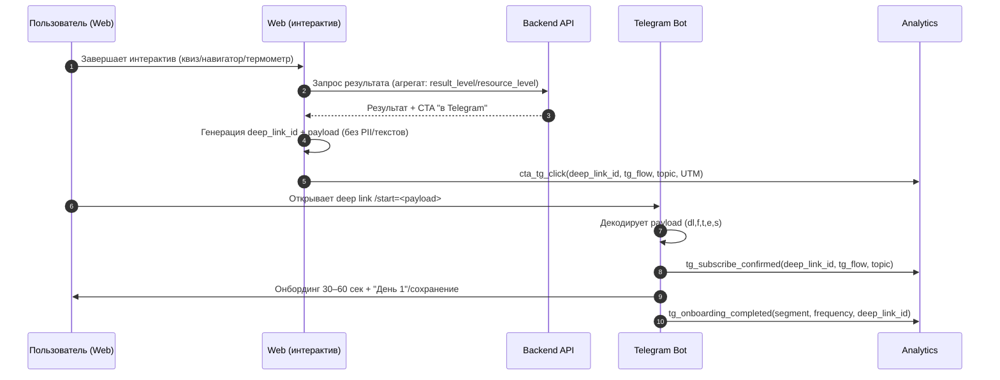
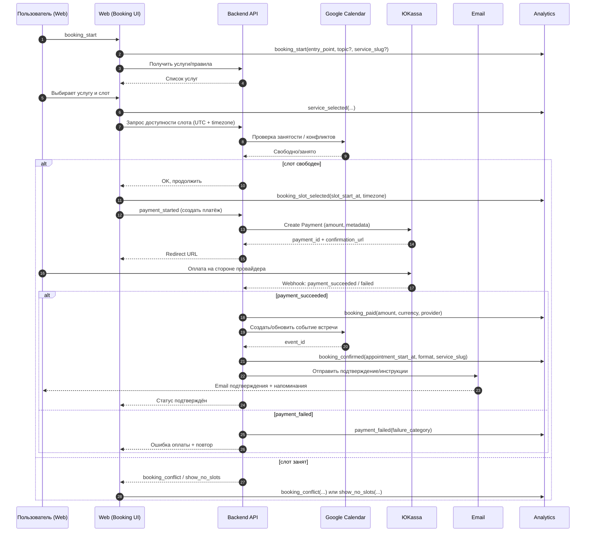
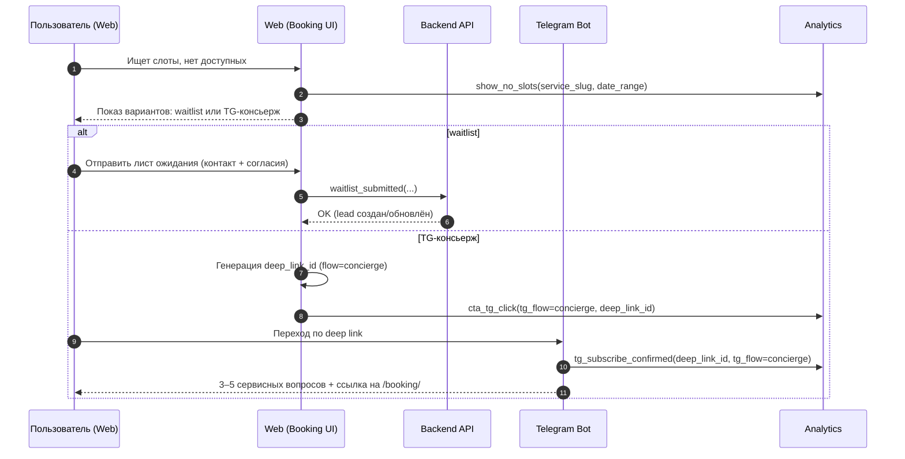
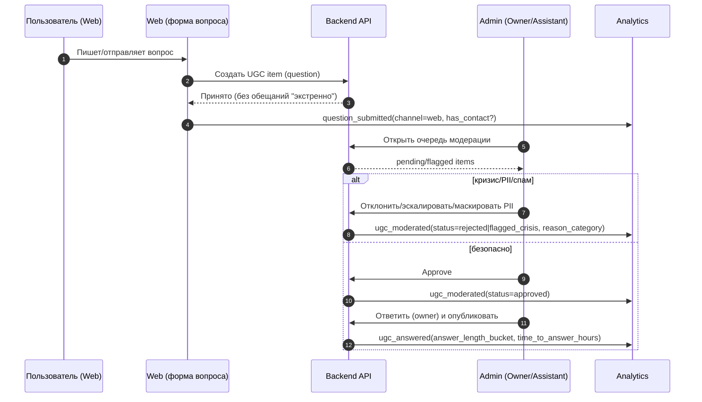

# Диаграммы (C4, sequence, deployment) — «Эмоциональный баланс»

**Версия:** v1.0  
**Дата:** 2026-01-07  
**Основано на:** `docs/Архитектурный-обзор.md`, `docs/PRD.md`, `docs/user-flows-cjm.md`, `docs/Tracking-Plan.md`, `docs/Telegram-Deep-Links-Schema.md`, `docs/Technical-Decisions.md`, `docs/Admin-Panel-Specification.md`

## 1) Назначение документа

Этот документ собирает в одном месте:
- **C4** (Context / Container / Component / Code) для целостного понимания системы;
- **Sequence** диаграммы ключевых сквозных сценариев (интерактивы → Telegram, запись → оплата → подтверждение, UGC/модерация);
- **Deployment** диаграмму (как это разворачивается и с чем интегрируется).

## 2) Обозначения и принципы (важно)

- **Границы системы**: то, что “внутри продукта” (Web/Backend/Admin/ЛК/аналитика событий), и внешние интеграции (Google Calendar, ЮKassa, Telegram, Email, провайдер аналитики).  
- **Privacy by design**: события аналитики и интеграции **не получают** PII/свободный текст/чувствительные данные; используются агрегаты (`result_level`, `resource_level`) и технические идентификаторы (`deep_link_id`).  
- **Источник истины**:
  - статусы оплаты — **только backend** по webhook ЮKassa (`booking_paid`, `payment_failed`);
  - подтверждение записи — **только backend** после атомарного создания брони (`booking_confirmed`).

---

## 3) C4 — System Context (UML Context)

```mermaid
flowchart LR
  %% C4: System Context
  user[Пользователь/Гость] -->|интерактивы, контент, запись| system((Система «Эмоциональный баланс»))
  client[Клиент (ЛК)] -->|дневники, встречи, экспорт PDF, согласия| system
  owner[Owner (психолог)] -->|админка: расписание/контент/интерактивы/CRM/модерация| system
  assistant[Assistant] -->|админка: расписание/лиды/модерация| system
  editor[Content-editor] -->|админка: контент/интерактивы (тексты)| system

  system <-->|слоты/занятость/создание событий| gcal[Google Calendar]
  system <-->|платёж/вебхуки статусов| ykassa[ЮKassa]
  system <-->|deep links, онбординг, серии, консьерж| tg[Telegram (канал + бот)]
  system <-->|подтверждения/напоминания| email[Email-провайдер]
  system -->|события без PII/текстов| analytics[Система аналитики]
```

---

## 4) C4 — Container (UML Container)

```mermaid
flowchart TB
  %% C4: Containers внутри System Boundary
  subgraph SystemBoundary[«Эмоциональный баланс» — System Boundary]
    web[Web-приложение (публичный сайт + booking UI + интерактивы)]
    lk[Личный кабинет (Web)]
    admin[Админ-панель (Web)]
    api[Backend API (доменная логика + RBAC + интеграции)]
    db[(PostgreSQL: продуктовые данные)]
    cache[(Redis/кэш/очереди — опционально)]
    media[(Медиа на VPS (локальная ФС + статика /media/*))]
    events[(События/журнал: event stream / audit log)]
  end

  user[Пользователь] --> web
  client[Клиент] --> lk
  owner[Owner/Assistant/Editor] --> admin

  web --> api
  lk --> api
  admin --> api

  api --> db
  api --> cache
  api --> media
  api --> events

  %% внешние системы
  api <-->|Calendar API| gcal[Google Calendar]
  api <-->|Payments API + Webhooks| ykassa[ЮKassa]
  api <-->|Bot API / ссылки / UTM| tg[Telegram (бот/канал)]
  api <-->|SMTP/API| email[Email-провайдер]
  events --> analytics[Система аналитики (без PII/текстов)]
```

---

## 5) C4 — Component (UML Component) для Backend API

```mermaid
flowchart LR
  %% C4: Components внутри Backend API
  subgraph API[Backend API]
    auth[Identity & Consents\n(сессии, роли, согласия)]
    content[Content\n(статьи/ресурсы/лендинги/подборки/словарь)]
    interactive[Interactive\n(квизы/навигатор/термометр/скрипты/ритуалы)]
    booking[Booking\n(услуги, слоты, бронь, конфликты, waitlist)]
    payments[Payments\n(создание платежа, webhooks, статусы)]
    lkmod[Client Cabinet\n(встречи/материалы, дневники, экспорт PDF)]
    moderation[UGC Moderation\n(очередь, статусы, SLA, кризис)]
    crm[CRM Leads\n(lead, timeline без текста)]
    notifications[Notifications\n(email/TG-уведомления)]
    integrations[Integrations\n(GCal, ЮKassa, TG, Email)]
    tracking[Tracking/Audit\n(события, запреты, дедуп)]
  end

  %% основные связи
  booking --> integrations
  payments --> integrations
  notifications --> integrations
  interactive --> tracking
  booking --> tracking
  payments --> tracking
  moderation --> tracking
  crm --> tracking

  %% общие зависимости
  auth --> booking
  auth --> lkmod
  auth --> tracking
```

---

## 6) C4 — Code (UML Code) / “Clean Architecture” с модулями домена

> Ниже — “кодовая” карта уровней для релиза 1: **можно реализовать монолитом**, но с жёсткими границами модулей (DDD bounded contexts) и зависимостями “внутрь”.

```mermaid
flowchart TB
  subgraph Presentation[Presentation Layer]
    webctrl[Web Controllers/SSR/Routes]
    adminctrl[Admin Controllers]
    apictrl[REST/GraphQL Controllers]
  end

  subgraph Application[Application Layer (Use Cases)]
    uc_booking[Use Cases: Booking]
    uc_payments[Use Cases: Payments]
    uc_interactive[Use Cases: Interactive]
    uc_lk[Use Cases: Client Cabinet]
    uc_moderation[Use Cases: Moderation]
    uc_crm[Use Cases: CRM/Leads]
    uc_tracking[Use Cases: Tracking/Audit]
  end

  subgraph Domain[Domain Layer (Entities/Services/Interfaces)]
    d_booking[Domain: Booking\n(Service, Slot, Appointment)]
    d_payments[Domain: Payments\n(Payment, PaymentStatus)]
    d_interactive[Domain: Interactive\n(Definition, Run, Aggregates)]
    d_identity[Domain: Identity & Consents\n(User, Role, Consent)]
    d_moderation[Domain: Moderation\n(ModerationItem, Decision)]
    d_crm[Domain: Leads\n(Lead, TimelineEvent)]
    d_content[Domain: Content\n(ContentItem)]
    ports[Ports (Interfaces)\nRepos + External Services]
  end

  subgraph Infrastructure[Infrastructure Layer]
    repo[DB Repositories (Postgres)]
    gcalc[Google Calendar Client]
    ykc[ЮKassa Client + Webhook verifier]
    tgc[TG Bot Client]
    mailer[Email Client]
    objstore[Media Storage (Local FS / static)]
    analyticsSink[Analytics Sink]
  end

  Presentation --> Application
  Application --> Domain
  Application --> ports
  Infrastructure --> ports
```

---

## 7) Sequence — Интерактив → Telegram (deep links + склейка аналитики)



---

## 8) Sequence — Запись: услуга → слот → оплата → подтверждение (Google Calendar + ЮKassa)



---

## 9) Sequence — “Нет слотов” → Telegram‑консьерж / waitlist (не тупик)



---

## 10) Sequence — UGC: “анонимный вопрос” → модерация → ответ (human-in-the-loop)



---

## 11) Deployment — целевая схема развёртывания (Release 1)

> Конкретные провайдеры могут отличаться, но логика узлов/границ и интеграций должна сохраниться.

```mermaid
flowchart TB
  %% Deployment
  user[Пользователь/Клиент\nBrowser] --> cdn[CDN/Edge]
  cdn --> web[Web App\n(публичный сайт + ЛК + админка)]
  web --> api[Backend API]

  api --> db[(PostgreSQL)]
  api --> cache[(Redis/Queue)]
  api --> media[(Media files on VPS (static /media/*))]

  api <-->|OAuth/API| gcal[Google Calendar]
  api <-->|API + Webhooks| ykassa[ЮKassa]
  api <-->|Bot API| tg[Telegram Bot]
  api --> tgChannel[Telegram Channel]
  api <-->|SMTP/API| email[Email Provider]

  api --> obs[Logs/Monitoring]
  api --> analytics[Analytics Sink\n(события без PII/текстов)]

  subgraph Environments[Окружения]
    dev[dev]
    stage[stage]
    prod[prod]
  end
```

---

## 12) Связанные документы (рекомендуемый порядок)

- **Сначала**: `docs/PRD.md`, `docs/user-flows-cjm.md`  
- **Затем**: `docs/Архитектурный-обзор.md`, `docs/Tracking-Plan.md`, `docs/Telegram-Deep-Links-Schema.md`  
- **Для админки**: `docs/Admin-Panel-Specification.md`  
- **Финальные решения**: `docs/Technical-Decisions.md`

