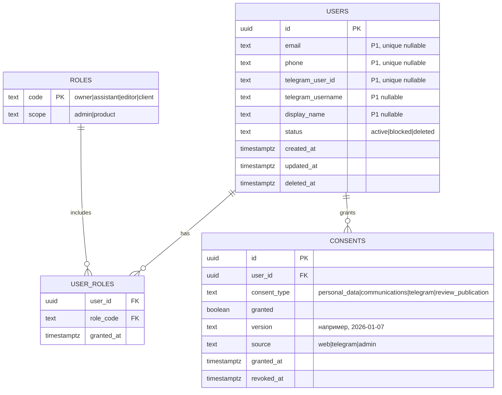
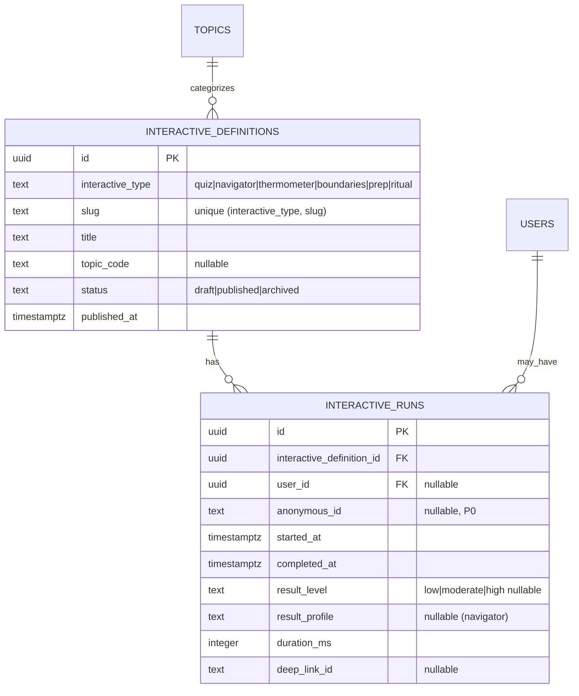
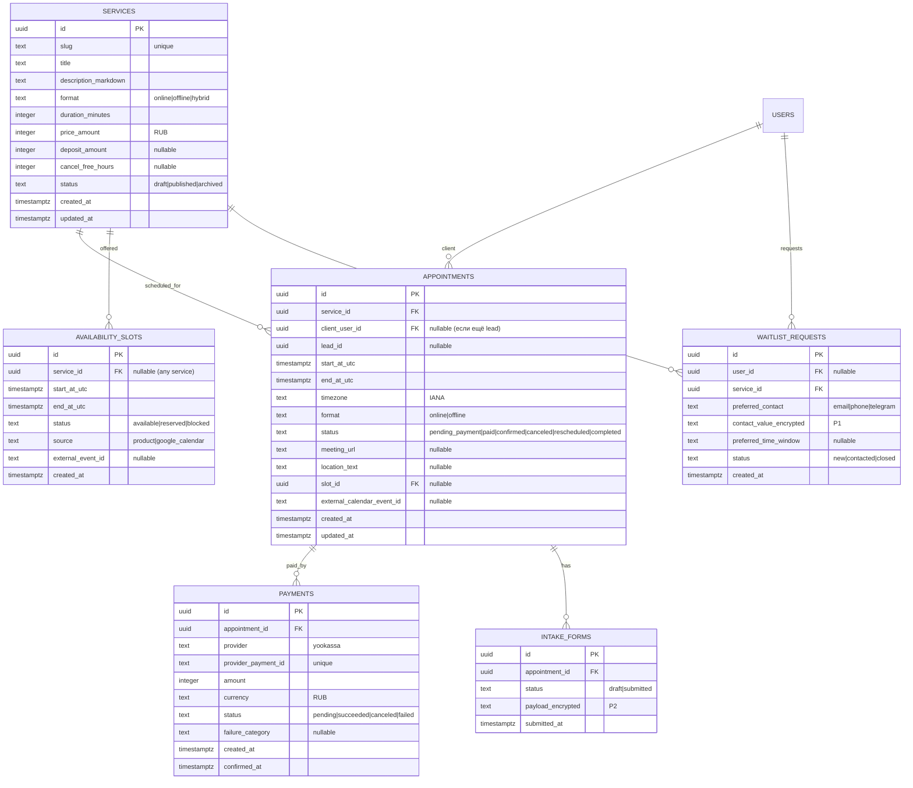
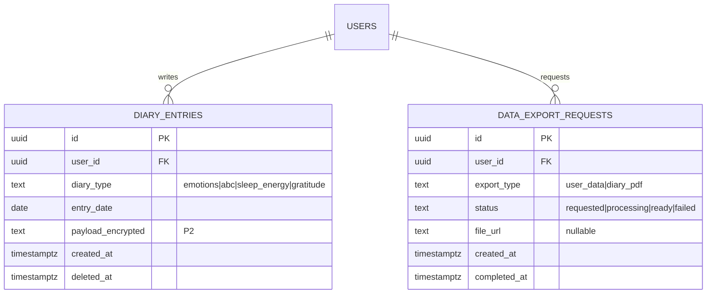
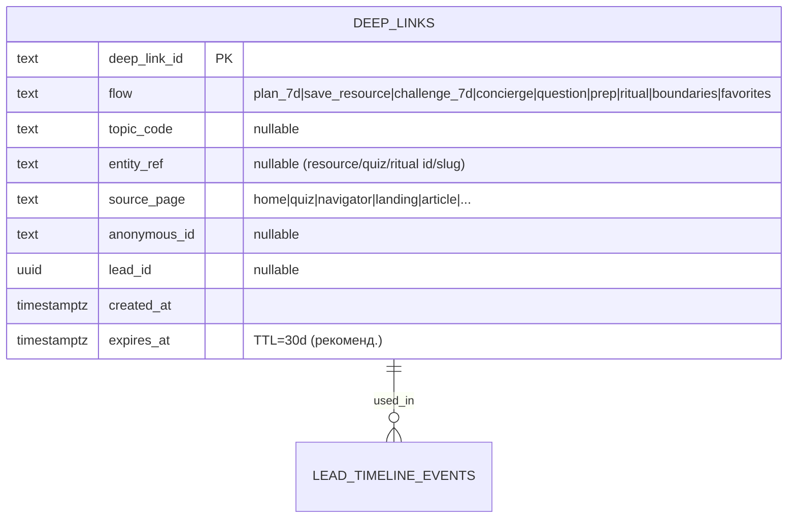
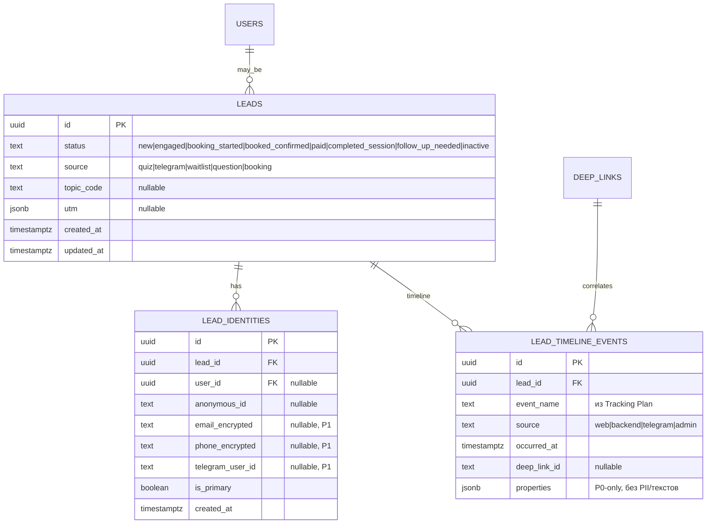
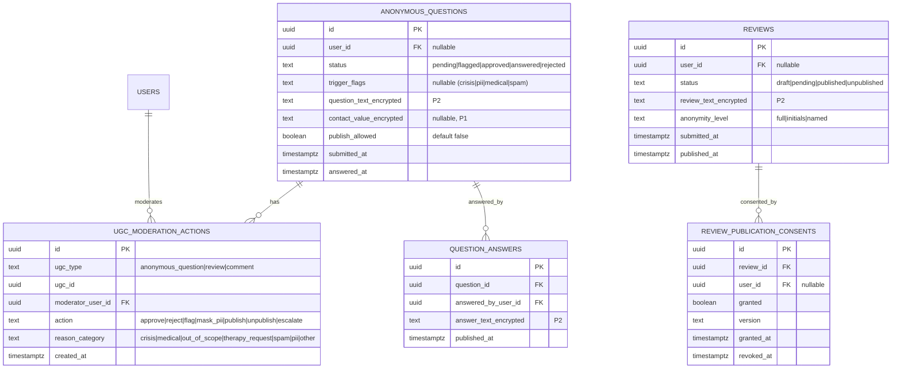
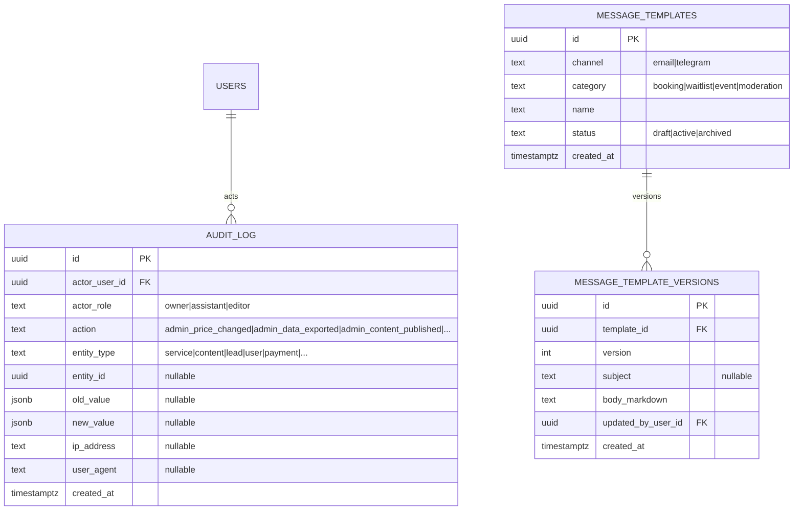

# Модель данных — «Эмоциональный баланс» (Release 1)

**Версия:** v1.0 (draft)  
**Дата:** 2026-01-07  
**Основано на:** `docs/PRD.md`, `docs/Tracking-Plan.md`, `docs/Admin-Panel-Specification.md`, `docs/Telegram-Deep-Links-Schema.md`, `docs/UGC-Moderation-Rules.md`, `docs/research/05-Booking-Payment-ClientCabinet.md`, `docs/research/08-Admin-CRM-Analytics.md`, `docs/research/10-Legal-Privacy-Compliance-RU.md`, `docs/Interactive-Modules-Matrix.md`.

Документ фиксирует **физическую модель данных продукта**: таблицы БД, ключи, ограничения и принципы хранения/минимизации данных.

**Важно:** Этот документ описывает **физическую схему БД (persistence layer)**. Для логической доменной модели с Aggregate Roots, Entities, Value Objects и Domain Events см. **`docs/Domain-Model-Specification.md`**.

---

## 0) Принципы модели данных (обязательные)

### Privacy by design (must-have)
- **Не храним и не отправляем в аналитику**: тексты дневников, ответы анкеты, тексты анонимных вопросов, свободный текст интерактивов, сырые ответы квизов.  
  Источник: `docs/Tracking-Plan.md`, `docs/research/10-*`.
- Для интерактивов сохраняем **только агрегаты** (например, `result_level=low|moderate|high`, `result_profile`) и технические метаданные.
- Платёжные реквизиты **не храним** (только `provider_payment_id`, статус и суммы). Источник: PRD `FR-PAY-*`.

### Общие соглашения по полям
- **PK**: `id` (UUID v4) или ULID (если нужен сортируемый ID). Для некоторых доменов допустимы короткие `*_id` (base62) — например, `deep_link_id`.
- **Время**: храним в UTC: `created_at`, `updated_at`, `deleted_at` (soft delete где нужно).
- **Slug**: `slug` — уникален **в пределах типа** (контент/услуги/мероприятия/термины).
- **Статусы**: enum/справочник (не “свободная строка”).

### Классификация данных (для проектирования доступа/шифрования)
- **P0 (safe)**: технические идентификаторы, UTM, slug, агрегаты `result_level`.
- **P1 (PII)**: `email`, `phone`, `telegram_*`, имя.
- **P2 (sensitive)**: дневники, анкеты, тексты UGC (анонимный вопрос/отзыв), любые признаки кризиса как содержание (мы храним только **категории/флаги**, не детали).

---

## 1) Границы (bounded contexts) и «ядро» сущностей

### Домены релиза 1
- **Identity & Access**: пользователи, роли, согласия.
- **Content**: статьи/ресурсы/лендинги/служебные страницы, теги/темы, подборки, словарь.
- **Interactive**: определения интерактивов (квизы/навигатор/термометр/скрипты/ритуалы), агрегированные результаты.
- **Booking & Payments**: услуги, слоты/расписание, встречи, оплаты, анкета, лист ожидания.
- **Client Cabinet**: дневники, экспорт PDF, управление данными.
- **Telegram**: deep links, склейка по `deep_link_id`.
- **CRM & Analytics**: лиды, таймлайн событий (без чувствительных текстов).
- **UGC Moderation**: анонимные вопросы/отзывы, статусы, модерация, ответы, согласия на публикацию.
- **Admin & Audit**: админские пользователи, аудит‑лог, шаблоны сообщений.

---

## 2) ER-диаграммы (обзор)

Ниже — ER‑диаграммы по доменам. Это **логическая** модель (сущности/связи); физическая схема БД (типы/индексы) выводится из неё.

---

## 2.1 Identity & Access (пользователи, роли, согласия)

### Ключевые ограничения
- **`users.email`** уникален, допускает NULL (если логин через magic link/Telegram ещё не привязан).
- **`users.telegram_user_id`** уникален, допускает NULL (связка TG ↔ user опциональна, источник: `docs/research/10-*`).
- **RBAC**: доступ к P2 данным (анкеты/дневники/UGC тексты) только ролям `owner/assistant` (и то по необходимости).

---

## 2.2 Content (CMS, темы/теги, подборки, словарь, медиа)

```mermaid
erDiagram
  USERS ||--o{ CONTENT_ITEMS : authors
  CONTENT_ITEMS ||--o{ CONTENT_ITEM_TOPICS : has
  TOPICS ||--o{ CONTENT_ITEM_TOPICS : includes
  CONTENT_ITEMS ||--o{ CONTENT_ITEM_TAGS : has
  TAGS ||--o{ CONTENT_ITEM_TAGS : includes
  MEDIA_ASSETS ||--o{ CONTENT_MEDIA : used_in
  CONTENT_ITEMS ||--o{ CONTENT_MEDIA : references

  CURATED_COLLECTIONS ||--o{ CURATED_ITEMS : contains
  CONTENT_ITEMS ||--o{ CURATED_ITEMS : may_include
  INTERACTIVE_DEFINITIONS ||--o{ CURATED_ITEMS : may_include

  GLOSSARY_TERMS ||--o{ GLOSSARY_TERM_SYNONYMS : has
  GLOSSARY_TERMS ||--o{ GLOSSARY_TERM_LINKS : links_to
  CONTENT_ITEMS ||--o{ GLOSSARY_TERM_LINKS : referenced_by

  CONTENT_ITEMS {
    uuid id PK
    text content_type "article|note|resource|landing|page"
    text slug "unique (content_type, slug)"
    text title
    text excerpt
    text body_markdown
    text status "draft|review|published|archived"
    timestamptz published_at
    uuid author_user_id FK
    text time_to_benefit "1_3_min|7_10_min|20_30_min|series"
    text format "article|note|resource|audio|checklist"
    text support_level "self_help|micro_support|consultation"
    timestamptz created_at
    timestamptz updated_at
  }

  TOPICS {
    text code PK "anxiety|burnout|relationships|boundaries|selfesteem|..."
    text title
    boolean is_active
  }

  TAGS {
    uuid id PK
    text slug "unique"
    text title
  }

  CONTENT_ITEM_TOPICS {
    uuid content_item_id FK
    text topic_code FK
  }

  CONTENT_ITEM_TAGS {
    uuid content_item_id FK
    uuid tag_id FK
  }

  MEDIA_ASSETS {
    uuid id PK
    text storage_provider "local_fs"
    text object_key "unique (relative path under media root)"
    text public_url
    text media_type "image|audio|pdf"
    text mime_type
    bigint size_bytes
    text title
    text alt_text
    uuid uploaded_by_user_id FK
    timestamptz created_at
  }

  CONTENT_MEDIA {
    uuid content_item_id FK
    uuid media_asset_id FK
    text usage "cover|inline|attachment|audio"
  }

  CURATED_COLLECTIONS {
    uuid id PK
    text slug "unique"
    text title
    text collection_type "problem|format|goal|context"
    text status "draft|published|archived"
    text topic_code "nullable (any)"
    timestamptz published_at
  }

  CURATED_ITEMS {
    uuid id PK
    uuid collection_id FK
    text item_type "content|interactive"
    uuid content_item_id FK "nullable"
    uuid interactive_definition_id FK "nullable"
    int position
    text note "nullable"
  }

  GLOSSARY_TERMS {
    uuid id PK
    text slug "unique"
    text title
    text category "approach|state|concept"
    text short_definition
    text body_markdown
    text status "draft|published|archived"
    timestamptz published_at
  }

  GLOSSARY_TERM_SYNONYMS {
    uuid id PK
    uuid term_id FK
    text synonym
  }

  GLOSSARY_TERM_LINKS {
    uuid id PK
    uuid term_id FK
    uuid content_item_id FK
    text link_type "mentioned_in|recommended"
  }
```

### Ключевые ограничения
- `content_items.slug` уникален в паре **(`content_type`, `slug`)**.
- `curated_items` — XOR‑связь: заполнено либо `content_item_id`, либо `interactive_definition_id` (не оба).
- `media_assets.object_key` уникален; метаданные (`alt_text`) обязательны для изображений (A11y).

---

## 2.3 Interactive (определения интерактивов + агрегированные результаты)

> В релизе 1 интерактивы должны работать **без обязательной авторизации** (см. `docs/Technical-Decisions.md`), но для CRM/аналитики полезно хранить агрегаты прохождения **без сырых ответов**.

### Ключевые ограничения
- `interactive_runs` **не содержит**: сырые ответы, тексты выборов, свободный текст.
- Связь `user_id` *или* `anonymous_id` (можно хранить оба, если авторизация произошла во время сессии, но без PII).
- Если требуется редактируемость интерактивов в админке “без кода”, физическая модель расширяется под конкретные типы (квиз‑вопросы/пороги, сценарии скриптов границ, библиотека ритуалов). Это можно оформлять отдельными таблицами по типам, не меняя общего `interactive_definitions`.

---

## 2.4 Booking & Payments (услуги, слоты, встречи, оплаты, анкета, лист ожидания)

### Ключевые ограничения (критичные для корректности)
- **Защита от конфликтов бронирования** (PRD `FR-BKG-7`):
  - уникальность по времени в `appointments` на уровне “провайдера расписания” (минимум: `UNIQUE(start_at_utc)` в рамках одной занятости владельца, плюс транзакционная блокировка слота).
  - `availability_slots.status` должен переходить `available → reserved` атомарно (optimistic/pessimistic lock).
- `payments.provider_payment_id` уникален (идемпотентность вебхуков).
- `intake_forms.payload_encrypted` хранится шифрованно, доступ только `owner` (и опционально `assistant`), не участвует в аналитике.

---

## 2.5 Client Cabinet (дневники, экспорт PDF, удаление данных)

### Ключевые ограничения
- Дневники — **приватные по умолчанию** (см. `docs/UGC-Moderation-Rules.md`), не видны никому кроме пользователя (без отдельного механизма “поделиться”).
- Удаление дневников — физическое или soft delete по политике хранения, но **пользовательский UX** должен гарантировать “удалено” (PRD `FR-LK-2`).

---

## 2.6 Telegram & deep links (склейка Web ↔ Telegram)

### Ограничения
- Payload deep link **не содержит PII и текстов** (см. `docs/Telegram-Deep-Links-Schema.md`).
- TTL: 30 дней достаточно для аналитики и дебага (см. тот же документ).

---

## 2.7 CRM & Analytics (лиды, таймлайн событий без текстов)

### Ограничения
- `lead_timeline_events.properties` проходит “валидатор запрета” (PII/тексты) по правилам `docs/Tracking-Plan.md`.
- Лид создаётся при первом “контактном” событии (waitlist/booking/intake/telegram link) — источник: `docs/Tracking-Plan.md`.

---

## 2.8 UGC Moderation (анонимные вопросы, отзывы, модерация, ответы, согласия)

### Ограничения
- Для UGC действуют SLA/статусы и кризис‑процедуры из `docs/UGC-Moderation-Rules.md`.
- Публикация отзывов/кейсов — только при наличии согласия и возможности отзыва (см. PRD `FR-TRUST-3`).

---

## 2.9 Admin & Audit (аудит‑лог, шаблоны сообщений)

### Ограничения
- Аудит‑лог обязателен для критичных действий (цены, экспорт данных, удаления) — см. PRD `FR-ADM-5`.
- Хранение audit‑лога: минимум 3 года (требование из админ‑спеки; уточняется юристом).

---

## 3) Сущности и ключевые бизнес-ограничения (короткий перечень)

### Запись/оплата
- **`services`**: формат, длительность, цена/депозит, правила отмены.
- **`availability_slots`**: доступные интервалы времени, источник (product/google_calendar), статус.
- **`appointments`**: встреча клиента; статусы должны быть согласованы с backend‑истиной (`booking_paid`, `booking_confirmed`).
- **`payments`**: идемпотентность по `provider_payment_id`, источник истины — webhook провайдера.

### Контент
- **`content_items`**: единый типизированный контент с markdown; публикация через статус.
- **`topics/tags`**: таксономия сквозная (для контента, интерактивов, аналитики).
- **`curated_collections`** и **`glossary_terms`** — включены в релиз 1 (см. `docs/Technical-Decisions.md`).

### Интерактивы
- Общая сущность **`interactive_definitions`** + агрегаты **`interactive_runs`**.
- Конкретные “редакторы” (квиз/ритуалы/скрипты) добавляются отдельными таблицами, но сохраняют принцип: **никаких сырых ответов/текстов в аналитике**.

### CRM/лиды и аналитика
- **`leads`**: создаются при первом “контактном” событии.
- **`lead_timeline_events`**: хранит события по tracking plan, но **строго без PII/текстов**.
- **`deep_links`**: TTL 30 дней, ключ склейки `deep_link_id`.

### UGC
- Все тексты UGC (вопросы/ответы/отзывы) — P2, шифрование + ограничение доступов.
- Публикация отзывов — только при наличии согласия и возможности отзыва.

---

## 4) Рекомендации по индексации (минимум для релиза 1)

- `content_items (content_type, slug)` UNIQUE
- `services (slug)` UNIQUE
- `glossary_terms (slug)` UNIQUE
- `curated_collections (slug)` UNIQUE
- `payments (provider, provider_payment_id)` UNIQUE
- `appointments (start_at_utc)` + индекс по `status`
- `availability_slots (start_at_utc, status)` + индекс по `source`
- `lead_timeline_events (lead_id, occurred_at)` индекс
- `deep_links (deep_link_id)` PK + индекс по `created_at` (для TTL очистки)

---

## 5) Политики хранения (TTL) — минимально необходимое

> Конкретные сроки финализируются юристом, но технически мы должны поддерживать TTL/удаление.

- **`deep_links`**: TTL 30 дней (аналитика/склейка).
- **`interactive_runs`**: TTL 30–90 дней (или хранить только для агрегатов/CRM), без сырых ответов.
- **`anonymous_questions`**: TTL 90 дней после ответа (как в матрице интерактивов) или удаление по запросу.
- **`diary_entries`**: пока аккаунт активен, с возможностью удаления пользователем в любой момент.
- **`audit_log`**: 3 года (минимум) — как требование админки.

